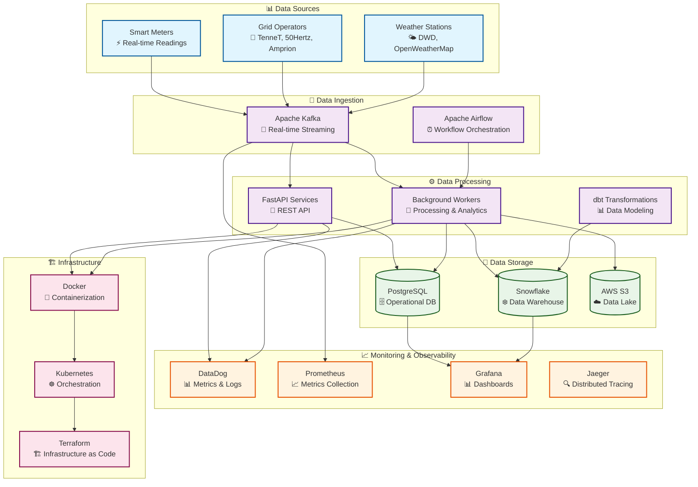

# Metrify Smart Metering Data Pipeline v2

> **⚡ Powering Germany's Energy Transition with Real-Time Smart Meter Intelligence**

Transform millions of smart meters into actionable insights with our enterprise-grade data pipeline. Built for scale, security, and the future of decentralized energy grids.

> **⚠️ PROPRIETARY SOFTWARE**: This is proprietary software owned by Metrify. Unauthorized use, distribution, or modification is strictly prohibited. For licensing inquiries, contact licensing@metrify.com

## 🎯 System Overview



## 🚀 Key Features

### Core Capabilities
- **⚡ Real-time Processing**: Sub-second latency for critical smart meter data
- **📈 Scalable Architecture**: Handles millions of meters with horizontal scaling
- **🛡️ Enterprise Security**: End-to-end encryption, RBAC, and audit logging
- **🔍 Data Quality**: Automated validation, anomaly detection, and quality scoring
- **📊 Advanced Analytics**: ML-powered insights and predictive analytics
- **🌐 Multi-tenant**: Support for multiple energy providers and grid operators

### Energy Sector Specific
- **🔌 Smart Meter Integration**: Real-time consumption, voltage, and power factor monitoring
- **⚡ Grid Stability Analysis**: Multi-operator grid status monitoring and analysis
- **🌤️ Weather Correlation**: Energy demand forecasting based on weather patterns
- **🚨 Anomaly Detection**: Automated detection of meter malfunctions and data quality issues
- **📋 Compliance**: GDPR, energy sector regulations, and audit requirements

## ✨ Why Choose This Solution?

### 🎯 **Built for Scale**
- Handle **millions of smart meters** with sub-second latency
- **Horizontal scaling** across multiple data centers
- **Auto-scaling** based on real-time demand

### 🛡️ **Enterprise-Grade Security**
- **End-to-end encryption** for all data in transit and at rest
- **Role-based access control** with fine-grained permissions
- **Complete audit trail** for compliance and security

### 🔧 **Developer-Friendly**
- **Clean Architecture** for maintainable, testable code
- **Comprehensive documentation** and examples
- **Easy deployment** with Docker and Kubernetes

### ⚡ **Real-Time Intelligence**
- **Live data processing** from smart meters
- **ML-powered anomaly detection** for proactive maintenance
- **Weather correlation** for demand forecasting

## 🏗️ Clean Architecture

This solution implements a **Clean Architecture** pattern with clear separation of concerns, making it highly maintainable, testable, and scalable for enterprise environments.

### Architecture Principles

- **🏛️ Clean Architecture**: Clear separation between business logic, data access, and presentation layers
- **🎯 Domain-Driven Design**: Business logic centered around smart metering domain
- **🔧 SOLID Principles**: Single responsibility, open/closed, dependency inversion
- **📦 Repository Pattern**: Abstract data access layer for testability
- **🔄 CQRS**: Command Query Responsibility Segregation for complex operations
- **📊 Event Sourcing**: Complete audit trail and state management
- **💉 Dependency Injection**: Loose coupling and high testability

## 🏛️ Clean Architecture Layers

```
┌─────────────────────────────────────────────────────────────┐
│                    Presentation Layer                       │
│  ┌─────────────┐ ┌─────────────┐ ┌─────────────────────┐   │
│  │   REST API  │ │     CLI     │ │   Background        │   │
│  │             │ │             │ │   Workers           │   │
│  └─────────────┘ └─────────────┘ └─────────────────────┘   │
└─────────────────────────────────────────────────────────────┘
┌─────────────────────────────────────────────────────────────┐
│                   Application Layer                        │
│  ┌─────────────┐ ┌─────────────┐ ┌─────────────────────┐   │
│  │  Use Cases  │ │     DTOs    │ │   Event/Command     │   │
│  │             │ │             │ │   Handlers          │   │
│  └─────────────┘ └─────────────┘ └─────────────────────┘   │
└─────────────────────────────────────────────────────────────┘
┌─────────────────────────────────────────────────────────────┐
│                      Core Layer                            │
│  ┌─────────────┐ ┌─────────────┐ ┌─────────────────────┐   │
│  │   Domain    │ │  Services   │ │   Interfaces        │   │
│  │   Models    │ │             │ │   & Exceptions      │   │
│  └─────────────┘ └─────────────┘ └─────────────────────┘   │
└─────────────────────────────────────────────────────────────┘
┌─────────────────────────────────────────────────────────────┐
│                 Infrastructure Layer                       │
│  ┌─────────────┐ ┌─────────────┐ ┌─────────────────────┐   │
│  │  Database   │ │  External   │ │   Monitoring        │   │
│  │  & Repos    │ │  Services   │ │   & Logging         │   │
│  └─────────────┘ └─────────────┘ └─────────────────────┘   │
└─────────────────────────────────────────────────────────────┘
```

## 📁 Project Structure

This project follows **Clean Architecture** principles with clear separation of concerns:

- **`src/`** - Core business logic and infrastructure
  - **`core/`** - Domain models, services, and interfaces
  - **`infrastructure/`** - Database, external services, and monitoring
  - **`application/`** - Use cases, DTOs, and handlers
- **`presentation/`** - REST API, CLI tools, and background workers
- **`config/`** - Environment-specific configurations
- **`tests/`** - Comprehensive test suite (unit, integration, e2e, performance)
- **`infrastructure/`** - Docker, Kubernetes, and Terraform configurations
- **`docs/`** - Complete documentation and user guides
- **`dbt/`** - Data transformation models and tests

📋 **For detailed project structure, see [Project Structure](docs/project-structure.md)**

## 🛠️ Technology Stack

### Core Technologies
- **🐍 Python 3.11+**: Modern Python with type hints and async support
- **🏗️ FastAPI**: High-performance async web framework
- **🗄️ PostgreSQL 15+**: Primary operational database
- **❄️ Snowflake**: Data warehouse for analytics
- **☁️ AWS**: Cloud infrastructure and services

### Data Processing
- **🌊 Apache Kafka**: Real-time data streaming
- **⚡ Apache Spark**: Large-scale data processing
- **🔄 Apache Airflow**: Workflow orchestration
- **📊 dbt**: Data transformation and modeling

### Infrastructure
- **🐳 Docker**: Containerization
- **☸️ Kubernetes**: Container orchestration
- **🏗️ Terraform**: Infrastructure as Code
- **📈 DataDog**: Monitoring and observability

### Development & Testing
- **🧪 pytest**: Testing framework with async, coverage, and performance testing
- **📊 pytest-cov**: Code coverage analysis
- **🔍 mypy**: Static type checking
- **🖤 black**: Code formatting
- **📋 pre-commit**: Git hooks for code quality
- **📦 Single requirements.txt**: All dependencies in one comprehensive file

## 🚀 Get Started in Minutes

Ready to transform your smart meter data into actionable insights? Follow our quick start guide to get up and running in minutes.

## 🚀 Quick Start

### Prerequisites
- Python 3.11+
- Docker & Docker Compose
- PostgreSQL 15+
- AWS CLI configured
- Snowflake account

### 1. Clone and Setup
```bash
git clone https://github.com/metrify/smart-metering-pipeline.git
cd smart-metering-pipeline
python -m venv venv
source venv/bin/activate  # On Windows: venv\Scripts\activate
pip install -r requirements.txt  # Installs all dependencies including dbt, testing, and development tools
```

### 2. Configuration
```bash
cp config/environments/development.yaml config/active.yaml
# Edit config/active.yaml with your settings
```

### 3. Database Setup
```bash
# Start PostgreSQL
docker-compose -f infrastructure/docker/docker-compose.yml up -d postgres

# Run migrations
python scripts/migrate.py --environment development
```

### 4. Start Services
```bash
# Start all services
docker-compose -f infrastructure/docker/docker-compose.yml up -d

# Or start specific services
python -m presentation.api.main  # Start API server
python -m presentation.workers.ingestion_worker  # Start ingestion worker
```

### 5. Verify Installation
```bash
# Health check
curl http://localhost:8000/health

# API documentation
open http://localhost:8000/docs
```

## 🎯 What's Next?

### 🏃‍♂️ **Quick Wins**
- **Explore the API**: Visit `http://localhost:8000/docs` for interactive API documentation
- **Check Data Quality**: Run quality checks on your smart meter data
- **View Analytics**: Access real-time dashboards and reports

### 🚀 **Advanced Usage**
- **Custom Integrations**: Connect your existing systems via our REST API
- **Data Pipeline**: Set up automated data processing workflows
- **Monitoring**: Configure alerts and monitoring for your deployment

### 📚 **Learn More**
- **Architecture Deep Dive**: Understand the system design and components
- **API Reference**: Complete API documentation with examples
- **Deployment Guide**: Production deployment strategies and best practices

## 📚 Documentation

### 📁 Project Structure
- **[Project Structure](docs/project-structure.md)** - Complete project structure and file organization

### 🏗️ Architecture Documentation
- **[System Overview](docs/architecture/system-overview.md)** - High-level system architecture and components
- **[Data Flow](docs/architecture/data-flow.md)** - How data moves through the system
- **[Technology Stack](docs/architecture/technology-stack.md)** - Technologies and tools used
- **[Security Architecture](docs/architecture/security-architecture.md)** - Security design and implementation
- **[Scalability Design](docs/architecture/scalability-design.md)** - How the system scales

### 🔌 API Documentation
- **[API Overview](docs/api/api-overview.md)** - REST API introduction and authentication
- **[Smart Meter API](docs/api/smart-meter-api.md)** - Smart meter endpoints and operations
- **[Grid Operator API](docs/api/grid-operator-api.md)** - Grid operator endpoints and operations
- **[Weather API](docs/api/weather-api.md)** - Weather station endpoints and operations
- **[Analytics API](docs/api/analytics-api.md)** - Analytics and reporting endpoints
- **[API Reference](docs/api/api-reference.md)** - Complete API reference with examples

### 🚀 Deployment Documentation
- **[Deployment Overview](docs/deployment/deployment-overview.md)** - Deployment strategies and environments
- **[Local Development](docs/deployment/local-development.md)** - Setting up local development environment
- **[Docker Deployment](docs/deployment/docker-deployment.md)** - Containerized deployment
- **[Kubernetes Deployment](docs/deployment/kubernetes-deployment.md)** - Kubernetes orchestration
- **[Production Deployment](docs/deployment/production-deployment.md)** - Production deployment guide
- **[Monitoring Setup](docs/deployment/monitoring-setup.md)** - Monitoring and observability setup

### 👥 User Guides
- **[Getting Started](docs/user_guides/getting-started.md)** - Quick start guide for new users
- **[Data Ingestion Guide](docs/user_guides/data-ingestion-guide.md)** - How to ingest data into the system
- **[Data Quality Guide](docs/user_guides/data-quality-guide.md)** - Understanding and managing data quality
- **[Analytics Guide](docs/user_guides/analytics-guide.md)** - Using analytics and reporting features
- **[Troubleshooting Guide](docs/user_guides/troubleshooting-guide.md)** - Common issues and solutions
- **[Best Practices](docs/user_guides/best-practices.md)** - Recommended practices and guidelines

### 📊 Data Transformation (dbt)
- **[dbt Project Overview](dbt/README.md)** - dbt project structure and configuration
- **[Data Models](dbt/models/)** - Staging, marts, and metrics models
- **[Tests and Quality](dbt/tests/)** - Data quality tests and validations
- **[Macros](dbt/macros/)** - Reusable SQL functions and transformations

## 🎯 Quick Navigation

### For Business Users
- Start with [Getting Started](docs/user_guides/getting-started.md)
- Learn about [Data Quality](docs/user_guides/data-quality-guide.md)
- Explore [Analytics Features](docs/user_guides/analytics-guide.md)

### For Developers
- Start with [Project Structure](docs/project-structure.md) to understand the codebase
- Review [System Architecture](docs/architecture/system-overview.md)
- Check [API Documentation](docs/api/api-overview.md)
- Follow [Local Development](docs/deployment/local-development.md)

### For DevOps Engineers
- Study [Deployment Overview](docs/deployment/deployment-overview.md)
- Configure [Monitoring](docs/deployment/monitoring-setup.md)
- Set up [Production Environment](docs/deployment/production-deployment.md)

### For Data Engineers
- Start with [Project Structure](docs/project-structure.md) to understand the data pipeline
- Understand [Data Flow](docs/architecture/data-flow.md)
- Learn [Data Ingestion](docs/user_guides/data-ingestion-guide.md)
- Review [Data Quality](docs/user_guides/data-quality-guide.md)
- Explore [dbt Transformations](dbt/README.md)


## 📊 Visual Guides

This documentation includes comprehensive Mermaid diagrams to help visualize:

- **System Architecture** - How components interact
- **Data Flow** - How data moves through the system
- **User Workflows** - Step-by-step user processes
- **Deployment Processes** - How to deploy the system
- **Troubleshooting Flows** - How to resolve issues

## 🤝 Contributing

### Development Access
This is a **proprietary project** with restricted access. Only authorized Metrify team members and approved contributors may contribute to this repository.

### For Authorized Contributors
1. **Clone** the repository (access required)
2. **Create** a feature branch from `main`
3. **Write** tests for new functionality
4. **Implement** the feature following our standards
5. **Run** the test suite: `pytest`
6. **Submit** a pull request for review

### Code Standards
- **Type Hints**: All functions must have type hints
- **Documentation**: All public APIs must be documented
- **Testing**: Minimum 80% code coverage
- **Linting**: Code must pass all linting checks
- **Security**: Follow security best practices and guidelines

### External Contributions
If you're interested in contributing but don't have access, please contact:
- **Email**: contributions@metrify.com
- **Subject**: "Contribution Interest - Metrify Smart Metering Pipeline"

## 📄 License

This project is **proprietary software** owned by Metrify. All rights reserved.

### Usage Rights
- **Commercial Use**: Requires explicit written permission from Metrify
- **Distribution**: Prohibited without authorization
- **Modification**: Not permitted without prior consent
- **Private Use**: Limited to authorized personnel only

### Permission Requests
To use this software, please contact:
- **Email**: licensing@metrify.com
- **Subject**: "Metrify Smart Metering Data Pipeline - License Request"
- **Include**: Intended use case, organization details, and contact information

### Terms
By accessing this repository, you agree to:
1. Not use the software without proper authorization
2. Respect intellectual property rights
3. Contact Metrify for any licensing inquiries
4. Comply with all applicable laws and regulations

**© 2025 Metrify. All rights reserved.**

## 🆘 Support

- **Documentation**: [docs.metrify.com](https://docs.metrify.com)
- **Issues**: [GitHub Issues](https://github.com/metrify/smart-metering-pipeline/issues)
- **Discussions**: [GitHub Discussions](https://github.com/metrify/smart-metering-pipeline/discussions)
- **Email**: support@metrify.com

## 🙏 Acknowledgments

- **Enpal**: For the vision and support
- **Open Source Community**: For the amazing tools and libraries
- **Energy Sector**: For the domain expertise and requirements

---

**Built with ❤️ by the Metrify Data Engineering Team**

*Empowering the energy transition through data-driven insights*
