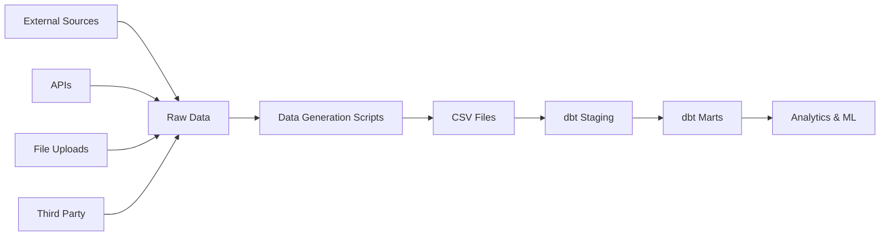

# 📊 Data Directory Structure

This directory contains all data files for the Metrify Smart Metering system, organized by data source and processing stage.

## 📁 Directory Structure

```
data/
├── raw/                          # Raw data from external sources
│   ├── smart_meters/            # Smart meter reference data
│   ├── weather_stations/        # Weather station reference data  
│   ├── grid_operators/          # Grid operator reference data
│   └── solar_panels/            # Solar panel reference data
├── processed/                    # Processed and cleaned data
│   ├── staging/                 # dbt staging layer outputs
│   ├── marts/                   # dbt marts layer outputs
│   └── metrics/                 # dbt metrics layer outputs
├── external/                     # External data sources
│   ├── api_exports/             # Data exported from APIs
│   ├── file_uploads/            # Manually uploaded files
│   └── third_party/             # Third-party data sources
└── archive/                      # Archived historical data
    ├── daily/                   # Daily archives
    ├── monthly/                 # Monthly archives
    └── yearly/                  # Yearly archives
```

## 🔄 Data Flow



## 📋 Data Sources

### 1. Smart Meters ⚡
- **Source**: Real-time smart meter readings
- **Frequency**: Every 15 minutes
- **Format**: CSV with columns matching `smart_meter_readings` table
- **Location**: `data/raw/smart_meters/`

**Key Fields**:
- `meter_id`: Unique meter identifier
- `reading_timestamp`: Time of reading
- `consumption_kwh`: Energy consumption
- `voltage_v`, `current_a`, `power_factor`, `frequency_hz`: Electrical parameters
- `quality_score`: Data quality metric (0-1)
- `is_anomaly`: Anomaly flag

### 2. Weather Stations 🌤️
- **Source**: DWD, OpenWeather APIs
- **Frequency**: Every 5 minutes
- **Format**: CSV with columns matching `weather_observations` table
- **Location**: `data/raw/weather_stations/`

**Key Fields**:
- `station_id`: Unique station identifier
- `observation_timestamp`: Time of observation
- `temperature_celsius`: Temperature in °C
- `humidity_percent`: Humidity percentage
- `pressure_hpa`: Atmospheric pressure
- `wind_speed_mps`, `wind_direction_degrees`: Wind data
- `precipitation_mm`: Precipitation amount

### 3. Grid Operators 🔌
- **Source**: TenneT, 50Hertz APIs
- **Frequency**: Every minute
- **Format**: CSV with columns matching `grid_status` table
- **Location**: `data/raw/grid_operators/`

**Key Fields**:
- `operator_id`: Grid operator identifier
- `status_timestamp`: Time of status update
- `grid_frequency_hz`: Grid frequency
- `grid_voltage_kv`: Grid voltage
- `grid_load_mw`: Current load
- `is_grid_stable`: Stability indicator

### 4. Solar Panels ☀️
- **Source**: Renewable energy generation data
- **Frequency**: Every 15 minutes
- **Format**: CSV with generation data
- **Location**: `data/raw/solar_panels/`

## 🛠️ Data Generation

### Development Data Generation

For development and testing, use the data generation scripts:

```bash
# Generate all data sources
python scripts/generate_data/generate_all_data.py

# Generate specific data source
python scripts/generate_data/smart_meter_generator.py --count 1000 --days 30
python scripts/generate_data/weather_generator.py --count 500 --days 30
python scripts/generate_data/grid_operator_generator.py --count 100 --days 30
```

### Configuration

Data generation is configured via environment variables and config files:

- **Environment**: `development.env`, `production.env`
- **Data Quality Rules**: `config/data_quality.yaml`
- **Business Rules**: `config/business_rules.yaml`

## 📊 Data Quality

### Quality Tiers
- **EXCELLENT**: All validations pass, no anomalies
- **GOOD**: Minor issues, within acceptable ranges
- **FAIR**: Some quality issues, requires monitoring
- **POOR**: Significant quality issues, needs attention

### Validation Rules

#### Smart Meter Data
- Consumption: 0-1000 kWh
- Voltage: 200-250V
- Current: 0-100A
- Power Factor: 0-1
- Frequency: 49.5-50.5 Hz

#### Weather Data
- Temperature: -50°C to 60°C
- Humidity: 0-100%
- Pressure: 800-1100 hPa
- Wind Speed: 0-100 m/s
- Wind Direction: 0-360°

#### Grid Data
- Frequency: 45-65 Hz
- Voltage: 100-500 kV
- Load: 0+ MW
- Efficiency: 0-100%

## 🔄 Data Processing Pipeline

### 1. Ingestion
- Raw data is ingested from external sources
- Data is validated against schema
- Quality scores are calculated
- Anomalies are flagged

### 2. Staging (dbt)
- Data is cleaned and standardized
- Business logic is applied
- Time-based features are added
- Quality flags are generated

### 3. Marts (dbt)
- Data is aggregated and summarized
- Business metrics are calculated
- Dimensional models are created
- Analytics-ready tables are built

### 4. Analytics & ML
- Data is used for analytics dashboards
- Machine learning models are trained
- Predictive insights are generated
- Business intelligence reports are created

## 📈 Data Volume Estimates

### Daily Volumes
- **Smart Meter Readings**: ~1.4M records (1000 meters × 96 readings/day)
- **Weather Observations**: ~14K records (10 stations × 288 observations/day)
- **Grid Status**: ~1.4K records (2 operators × 1440 updates/day)
- **Solar Generation**: ~96K records (1000 panels × 96 readings/day)

### Storage Requirements
- **Raw Data**: ~500MB/day
- **Processed Data**: ~1GB/day
- **Archived Data**: ~365GB/year

## 🔒 Data Security

### Access Control
- Raw data: Data Engineers only
- Processed data: Analytics team + Data Engineers
- Public data: All authenticated users

### Data Privacy
- Personal data is anonymized
- Location data is generalized
- Sensitive business data is encrypted

### Retention Policy
- Raw data: 7 years
- Processed data: 3 years
- Archived data: Indefinite

## 🚀 Getting Started

### 1. Generate Development Data
```bash
# Clone the repository
git clone <repository-url>
cd DataEngineering

# Install dependencies
pip install -r requirements.txt

# Generate sample data
python scripts/generate_data/generate_all_data.py --environment development
```

### 2. Run dbt Models
```bash
# Navigate to dbt directory
cd dbt

# Install dbt dependencies
dbt deps

# Run staging models
dbt run --models staging

# Run all models
dbt run
```

### 3. Validate Data Quality
```bash
# Run dbt tests
dbt test

# Run custom data quality checks
python scripts/data_quality/run_quality_checks.py
```

## 📞 Support

For questions about data structure, quality, or generation:

- **Data Engineering Team**: data-engineering@metrify.com
- **Documentation**: [Internal Wiki](https://wiki.metrify.com/data)
- **Issues**: [GitHub Issues](https://github.com/metrify/DataEngineering/issues)

## 📝 Changelog

### v1.0.0 (2024-01-15)
- Initial data structure setup
- Smart meter data generation
- Weather station data generation
- Grid operator data generation
- dbt staging models
- Data quality validation

---

*Last updated: January 15, 2024*
*Maintained by: Metrify Data Engineering Team*
