# Metrify Smart Metering - Documentation

Welcome to the comprehensive documentation for the Metrify Smart Metering data pipeline. This documentation is designed for both technical and non-technical users, providing clear guidance on system architecture, usage, and operations.

## 🎯 System Overview

```mermaid
graph TB
    %% Data Sources
    subgraph "📊 Data Sources"
        SM[Smart Meters<br/>⚡ Real-time]
        GO[Grid Operators<br/>🔌 TenneT, 50Hertz]
        WS[Weather Stations<br/>🌤️ DWD, OpenWeather]
        SOLAR[Solar Panels<br/>☀️ Renewable]
    end

    %% Data Ingestion Layer
    subgraph "🌊 Data Ingestion"
        KAFKA[Apache Kafka<br/>📡 Streaming]
        AIRFLOW[Apache Airflow<br/>⏰ Orchestration]
        FLINK[Apache Flink<br/>⚡ Stream Processing]
    end

    %% Processing Layer
    subgraph "⚙️ Data Processing"
        API[FastAPI Services<br/>🚀 REST API]
        WORKERS[Background Workers<br/>🔄 Processing]
        DBT[dbt Transformations<br/>📊 Modeling]
        FLINK[Apache Flink<br/>⚡ Stream Processing]
    end

    %% Data Engineering Storage Layer
    subgraph "🗄️ Data Engineering Storage"
        POSTGRES[(PostgreSQL<br/>🗄️ Operational)]
        SNOWFLAKE[(Snowflake<br/>❄️ Warehouse)]
        S3[(Multi-Cloud<br/>☁️ AWS/Azure/GCP)]
        CACHE[(Redis Cache<br/>⚡ Caching)]
    end

    %% Data Consumption Layer
    subgraph "🎯 Data Consumption"
        ML[ML/AI Engine<br/>🤖 TensorFlow]
        ANALYTICS[Advanced Analytics<br/>📈 Forecasting]
        BI[Business Intelligence<br/>📊 Dashboards]
        REPORTS[Reporting Systems<br/>📋 Reports]
    end

    %% ML/Analytics Storage Layer
    subgraph "📈 ML/Analytics Storage"
        FEATURES[(Feature Store<br/>🔧 Features)]
        MODELS[(Model Registry<br/>🤖 Models)]
        RESULTS[(Results DB<br/>📊 Predictions)]
        VECTOR[(Vector DB<br/>🔍 Embeddings)]
    end

    %% Monitoring & Observability
    subgraph "📈 Monitoring & Observability"
        DATADOG[DataDog<br/>📊 Metrics]
        PROMETHEUS[Prometheus<br/>📈 Collection]
        GRAFANA[Grafana<br/>📊 Dashboards]
        JAEGER[Jaeger<br/>🔍 Tracing]
        QUALITY[Data Quality<br/>✅ Validation]
        GOVERNANCE[Data Governance<br/>🏛️ Atlas]
    end

    %% Infrastructure
    subgraph "🏗️ Infrastructure"
        DOCKER[Docker<br/>🐳 Containerization]
        K8S[Kubernetes<br/>☸️ Orchestration]
        TERRAFORM[Multi-Cloud Terraform<br/>🏗️ IaC]
        PERFORMANCE[Performance<br/>⚡ Optimization]
    end

    %% Data Flow
    SM --> KAFKA
    GO --> KAFKA
    WS --> KAFKA
    SOLAR --> KAFKA
    
    KAFKA --> API
    KAFKA --> WORKERS
    KAFKA --> FLINK
    AIRFLOW --> WORKERS
    AIRFLOW --> DBT
    
    API --> POSTGRES
    WORKERS --> POSTGRES
    WORKERS --> S3
    WORKERS --> CACHE
    
    %% Data Engineering Storage Flow
    S3 --> DBT
    DBT --> SNOWFLAKE
    FLINK --> S3
    FLINK --> POSTGRES
    
    %% Data Consumption Layer (consumes from Data Engineering Storage)
    SNOWFLAKE --> ML
    SNOWFLAKE --> ANALYTICS
    SNOWFLAKE --> BI
    SNOWFLAKE --> REPORTS
    
    %% ML/Analytics Storage Flow (stores results from Data Consumption)
    ML --> FEATURES
    ML --> MODELS
    ML --> RESULTS
    ANALYTICS --> RESULTS
    BI --> RESULTS
    REPORTS --> RESULTS
    ML --> VECTOR
    ANALYTICS --> VECTOR
    
    %% Monitoring connections
    API --> DATADOG
    WORKERS --> DATADOG
    ML --> DATADOG
    ANALYTICS --> DATADOG
    BI --> DATADOG
    REPORTS --> DATADOG
    KAFKA --> PROMETHEUS
    FLINK --> PROMETHEUS
    POSTGRES --> GRAFANA
    SNOWFLAKE --> GRAFANA
    CACHE --> GRAFANA
    FEATURES --> GRAFANA
    MODELS --> GRAFANA
    RESULTS --> GRAFANA
    VECTOR --> GRAFANA
    QUALITY --> GRAFANA
    GOVERNANCE --> GRAFANA
    
    %% Infrastructure connections
    API --> DOCKER
    WORKERS --> DOCKER
    ML --> DOCKER
    ANALYTICS --> DOCKER
    BI --> DOCKER
    REPORTS --> DOCKER
    FEATURES --> DOCKER
    MODELS --> DOCKER
    RESULTS --> DOCKER
    VECTOR --> DOCKER
    DOCKER --> K8S
    K8S --> TERRAFORM
    FLINK --> K8S
    PERFORMANCE --> K8S

    %% Styling
    classDef dataSource fill:#e1f5fe,stroke:#01579b,stroke-width:2px
    classDef processing fill:#f3e5f5,stroke:#4a148c,stroke-width:2px
    classDef consumption fill:#e8f5e8,stroke:#2e7d32,stroke-width:2px
    classDef dataEngineeringStorage fill:#e3f2fd,stroke:#1976d2,stroke-width:2px
    classDef mlAnalyticsStorage fill:#f3e5f5,stroke:#7b1fa2,stroke-width:2px
    classDef monitoring fill:#fff3e0,stroke:#e65100,stroke-width:2px
    classDef infrastructure fill:#fce4ec,stroke:#880e4f,stroke-width:2px

    class SM,GO,WS,SOLAR dataSource
    class KAFKA,AIRFLOW,API,WORKERS,DBT,FLINK processing
    class ML,ANALYTICS,BI,REPORTS consumption
    class POSTGRES,SNOWFLAKE,S3,CACHE dataEngineeringStorage
    class FEATURES,MODELS,RESULTS,VECTOR mlAnalyticsStorage
    class DATADOG,PROMETHEUS,GRAFANA,JAEGER,QUALITY,GOVERNANCE monitoring
    class DOCKER,K8S,TERRAFORM,PERFORMANCE infrastructure
```

## 🚀 Comprehensive System Overview

*This comprehensive view shows all advanced features including ML/AI, Advanced Analytics, Data Governance, Performance Optimization, and Multi-Cloud Architecture.*

The comprehensive system overview includes all the advanced features we've implemented:

### **🤖 Machine Learning & AI**
- **TensorFlow & MLflow**: Model development and lifecycle management
- **Feature Store**: Feast for feature management and serving
- **Model Serving**: Real-time ML model deployment
- **Data Drift Detection**: Evidently for model monitoring

### **📈 Advanced Analytics**
- **Time Series Forecasting**: Prophet and LSTM models
- **Multivariate Anomaly Detection**: Advanced pattern recognition
- **Interactive Visualizations**: Plotly and Dash dashboards
- **Predictive Maintenance**: Equipment health prediction

### **🏛️ Data Governance**
- **Apache Atlas**: Data catalog and lineage tracking
- **PII Detection & Masking**: Privacy protection
- **Compliance Automation**: GDPR and regulatory compliance
- **Data Classification**: Automatic data categorization

### **🔍 Data Quality Management**
- **Great Expectations**: Automated data validation
- **ML-based Quality Prediction**: Intelligent quality scoring
- **Quality Monitoring**: Real-time quality dashboards
- **Automated Remediation**: Self-healing data pipelines

### **⚡ Performance Optimization**
- **Multi-level Caching**: Redis and intelligent caching
- **Query Optimization**: Database performance tuning
- **Stream Processing**: Apache Flink integration
- **Real-time Analytics**: High-performance data processing

### **☁️ Multi-Cloud Architecture**
- **AWS (eu-central-1)**: Primary cloud infrastructure
- **Azure (Germany West Central)**: Secondary cloud
- **GCP (europe-west3)**: Tertiary cloud
- **Cross-Cloud Replication**: Data synchronization and failover

## 📚 Documentation Structure

### 📁 Project Structure
- **[Project Structure](project-structure.md)** - Complete project structure and file organization

### 🏗️ Architecture Documentation
- **[System Overview](architecture/system-overview.md)** - High-level system architecture and components
- **[Data Flow](architecture/data-flow.md)** - How data moves through the system
- **[Technology Stack](architecture/technology-stack.md)** - Technologies and tools used
- **[Security Architecture](architecture/security-architecture.md)** - Security design and implementation
- **[Scalability Design](architecture/scalability-design.md)** - How the system scales

### 🔌 API Documentation
- **[API Overview](api/api-overview.md)** - REST API introduction and authentication
- **[Smart Meter API](api/smart-meter-api.md)** - Smart meter endpoints and operations
- **[Grid Operator API](api/grid-operator-api.md)** - Grid operator endpoints and operations
- **[Weather API](api/weather-api.md)** - Weather station endpoints and operations
- **[Analytics API](api/analytics-api.md)** - Analytics and reporting endpoints
- **[API Reference](api/api-reference.md)** - Complete API reference with examples

### 🗄️ Infrastructure & Integrations
- **[Snowflake Integration](infrastructure/snowflake-integration.md)** - Snowflake data warehouse setup and usage

### 📊 Data Engineering Documentation
- **[Data Sources Configuration](data-engineering/data-sources-configuration.md)** - CSV file paths, Kafka topics, and data processing settings
- **[Smart Meter DAG Implementation](data-engineering/smart-meter-dag-implementation.md)** - Airflow DAG for smart meter data processing pipeline
- **[Worker Integration Implementation](data-engineering/worker-integration-implementation.md)** - Worker integration testing and Kafka message flow
- **[Data Quality Implementation](data-engineering/data-quality-implementation.md)** - Comprehensive data quality validation, monitoring, and error handling
- **[Performance Optimization Implementation](data-engineering/performance-optimization-implementation.md)** - Adaptive batch processing, resource management, and performance monitoring
- **[dbt Implementation](data-engineering/dbt-implementation.md)** - Data transformations, dimensional modeling, and analytics in Snowflake

### 🚀 Deployment Documentation
- **[Deployment Overview](deployment/deployment-overview.md)** - Deployment strategies and environments
- **[Local Development](deployment/local-development.md)** - Setting up local development environment
- **[Docker Deployment](deployment/docker-deployment.md)** - Containerized deployment
- **[Kubernetes Deployment](deployment/kubernetes-deployment.md)** - Kubernetes orchestration
- **[Production Deployment](deployment/production-deployment.md)** - Production deployment guide
- **[Monitoring Setup](deployment/monitoring-setup.md)** - Monitoring and observability setup

### 👥 User Guides
- **[Getting Started](user_guides/getting-started.md)** - Quick start guide for new users
- **[Data Ingestion Guide](user_guides/data-ingestion-guide.md)** - How to ingest data into the system
- **[Data Quality Guide](user_guides/data-quality-guide.md)** - Understanding and managing data quality
- **[Analytics Guide](user_guides/analytics-guide.md)** - Using analytics and reporting features
- **[Troubleshooting Guide](user_guides/troubleshooting-guide.md)** - Common issues and solutions
- **[Best Practices](user_guides/best-practices.md)** - Recommended practices and guidelines

### 📊 Data Transformation (dbt)
- **[dbt Project Overview](../dbt/README.md)** - dbt project structure and configuration
- **[Data Models](../dbt/models/)** - Staging, marts, and metrics models
- **[Tests and Quality](../dbt/tests/)** - Data quality tests and validations
- **[Macros](../dbt/macros/)** - Reusable SQL functions and transformations

### 🤖 Machine Learning & AI
- **[ML Overview](ml/ml-overview.md)** - Machine learning capabilities and architecture
- **[Model Training](ml/model-training.md)** - ML model development and training
- **[Model Deployment](ml/model-deployment.md)** - ML model serving and deployment
- **[ML Monitoring](ml/ml-monitoring.md)** - ML model monitoring and management

### 🏛️ Data Governance
- **[Governance Overview](governance/governance-overview.md)** - Data governance framework
- **[Data Catalog](governance/data-catalog.md)** - Data discovery and cataloging
- **[Data Lineage](governance/data-lineage.md)** - Data lineage tracking and visualization
- **[Privacy & Security](governance/privacy-security.md)** - Data protection and compliance

### 📈 Advanced Analytics
- **[Analytics Overview](analytics/analytics-overview.md)** - Advanced analytics capabilities
- **[Forecasting Guide](analytics/forecasting-guide.md)** - Time series forecasting
- **[Anomaly Detection](analytics/anomaly-detection-guide.md)** - Anomaly detection and analysis
- **[Visualization Guide](analytics/visualization-guide.md)** - Interactive visualizations

### 🔍 Data Quality
- **[Quality Overview](quality/quality-overview.md)** - Data quality management
- **[Quality Rules](quality/quality-rules.md)** - Data quality validation rules
- **[Quality Monitoring](quality/quality-monitoring.md)** - Quality monitoring and alerting
- **[Quality Automation](quality/quality-automation.md)** - Automated quality processes

### ⚡ Performance Optimization
- **[Performance Overview](performance/performance-overview.md)** - Performance optimization strategies
- **[Caching Guide](performance/caching-guide.md)** - Multi-level caching implementation
- **[Query Optimization](performance/query-optimization-guide.md)** - Database query optimization
- **[Stream Processing](performance/stream-processing-guide.md)** - Real-time stream processing

### ☁️ Multi-Cloud Architecture
- **[Multi-Cloud Overview](multicloud/multicloud-overview.md)** - Multi-cloud strategy and implementation
- **[AWS Deployment](multicloud/aws-deployment.md)** - AWS cloud deployment guide
- **[Azure Deployment](multicloud/azure-deployment.md)** - Azure cloud deployment guide
- **[GCP Deployment](multicloud/gcp-deployment.md)** - Google Cloud deployment guide

## 🎯 Quick Navigation

### For Business Users
- Start with [Getting Started](user_guides/getting-started.md)
- Learn about [Data Quality](user_guides/data-quality-guide.md)
- Explore [Analytics Features](user_guides/analytics-guide.md)

### For Developers
- Start with [Project Structure](project-structure.md) to understand the codebase
- Review [System Architecture](architecture/system-overview.md)
- Check [API Documentation](api/api-overview.md)
- Follow [Local Development](deployment/local-development.md)

### For DevOps Engineers
- Study [Deployment Overview](deployment/deployment-overview.md)
- Configure [Monitoring](deployment/monitoring-setup.md)
- Set up [Production Environment](deployment/production-deployment.md)

### For Data Engineers
- Start with [Project Structure](project-structure.md) to understand the data pipeline
- Understand [Data Flow](architecture/data-flow.md)
- Learn [Data Ingestion](user_guides/data-ingestion-guide.md)
- Review [Data Quality](user_guides/data-quality-guide.md)
- Explore [dbt Transformations](../dbt/README.md)

## 📊 Visual Guides

This documentation includes comprehensive Mermaid diagrams to help visualize:

- **System Architecture** - How components interact
- **Data Flow** - How data moves through the system
- **User Workflows** - Step-by-step user processes
- **Deployment Processes** - How to deploy the system
- **Troubleshooting Flows** - How to resolve issues

## 🔄 Documentation Updates

This documentation is maintained alongside the codebase and is updated with each release. For the most current information, always refer to the version in the main branch.

## 📞 Support

If you need help or have questions:
- Check the [Troubleshooting Guide](user_guides/troubleshooting-guide.md)
- Review [Best Practices](user_guides/best-practices.md)
- Contact the development team

## 📄 License

This documentation is part of the Metrify Smart Metering project and follows the same licensing terms.
