# Metrify Smart Metering - Documentation

Welcome to the comprehensive documentation for the Metrify Smart Metering data pipeline. This documentation is designed for both technical and non-technical users, providing clear guidance on system architecture, usage, and operations.

## 🎯 System Overview

```mermaid
graph TB
    %% Data Sources
    subgraph "📊 Data Sources"
        SM[Smart Meters<br/>⚡ Real-time Readings]
        GO[Grid Operators<br/>🔌 TenneT, 50Hertz, Amprion]
        WS[Weather Stations<br/>🌤️ DWD, OpenWeatherMap]
    end

    %% Data Ingestion Layer
    subgraph "🌊 Data Ingestion"
        KAFKA[Apache Kafka<br/>📡 Real-time Streaming]
        AIRFLOW[Apache Airflow<br/>⏰ Workflow Orchestration]
    end

    %% Processing Layer
    subgraph "⚙️ Data Processing"
        API[FastAPI Services<br/>🚀 REST API]
        WORKERS[Background Workers<br/>🔄 Processing & Analytics]
        DBT[dbt Transformations<br/>📊 Data Modeling]
    end

    %% Storage Layer
    subgraph "💾 Data Storage"
        POSTGRES[(PostgreSQL<br/>🗄️ Operational DB)]
        SNOWFLAKE[(Snowflake<br/>❄️ Data Warehouse)]
        S3[(AWS S3<br/>☁️ Data Lake)]
    end

    %% Monitoring & Observability
    subgraph "📈 Monitoring & Observability"
        DATADOG[DataDog<br/>📊 Metrics & Logs]
        PROMETHEUS[Prometheus<br/>📈 Metrics Collection]
        GRAFANA[Grafana<br/>📊 Dashboards]
        JAEGER[Jaeger<br/>🔍 Distributed Tracing]
    end

    %% Infrastructure
    subgraph "🏗️ Infrastructure"
        DOCKER[Docker<br/>🐳 Containerization]
        K8S[Kubernetes<br/>☸️ Orchestration]
        TERRAFORM[Terraform<br/>🏗️ Infrastructure as Code]
    end

    %% Data Flow
    SM --> KAFKA
    GO --> KAFKA
    WS --> KAFKA
    
    KAFKA --> API
    KAFKA --> WORKERS
    AIRFLOW --> WORKERS
    
    API --> POSTGRES
    WORKERS --> POSTGRES
    WORKERS --> SNOWFLAKE
    WORKERS --> S3
    
    DBT --> SNOWFLAKE
    
    %% Monitoring connections
    API --> DATADOG
    WORKERS --> DATADOG
    KAFKA --> PROMETHEUS
    POSTGRES --> GRAFANA
    SNOWFLAKE --> GRAFANA
    
    %% Infrastructure connections
    API --> DOCKER
    WORKERS --> DOCKER
    DOCKER --> K8S
    K8S --> TERRAFORM

    %% Styling
    classDef dataSource fill:#e1f5fe,stroke:#01579b,stroke-width:2px
    classDef processing fill:#f3e5f5,stroke:#4a148c,stroke-width:2px
    classDef storage fill:#e8f5e8,stroke:#1b5e20,stroke-width:2px
    classDef monitoring fill:#fff3e0,stroke:#e65100,stroke-width:2px
    classDef infrastructure fill:#fce4ec,stroke:#880e4f,stroke-width:2px

    class SM,GO,WS dataSource
    class KAFKA,AIRFLOW,API,WORKERS,DBT processing
    class POSTGRES,SNOWFLAKE,S3 storage
    class DATADOG,PROMETHEUS,GRAFANA,JAEGER monitoring
    class DOCKER,K8S,TERRAFORM infrastructure
```

## 📚 Documentation Structure

### 📁 Project Structure
- **[Project Structure](project-structure.md)** - Complete project structure and file organization

### 🏗️ Architecture Documentation
- **[System Overview](architecture/system-overview.md)** - High-level system architecture and components
- **[Data Flow](architecture/data-flow.md)** - How data moves through the system
- **[Technology Stack](architecture/technology-stack.md)** - Technologies and tools used
- **[Security Architecture](architecture/security-architecture.md)** - Security design and implementation
- **[Scalability Design](architecture/scalability-design.md)** - How the system scales

### 🔌 API Documentation
- **[API Overview](api/api-overview.md)** - REST API introduction and authentication
- **[Smart Meter API](api/smart-meter-api.md)** - Smart meter endpoints and operations
- **[Grid Operator API](api/grid-operator-api.md)** - Grid operator endpoints and operations
- **[Weather API](api/weather-api.md)** - Weather station endpoints and operations
- **[Analytics API](api/analytics-api.md)** - Analytics and reporting endpoints
- **[API Reference](api/api-reference.md)** - Complete API reference with examples

### 🚀 Deployment Documentation
- **[Deployment Overview](deployment/deployment-overview.md)** - Deployment strategies and environments
- **[Local Development](deployment/local-development.md)** - Setting up local development environment
- **[Docker Deployment](deployment/docker-deployment.md)** - Containerized deployment
- **[Kubernetes Deployment](deployment/kubernetes-deployment.md)** - Kubernetes orchestration
- **[Production Deployment](deployment/production-deployment.md)** - Production deployment guide
- **[Monitoring Setup](deployment/monitoring-setup.md)** - Monitoring and observability setup

### 👥 User Guides
- **[Getting Started](user_guides/getting-started.md)** - Quick start guide for new users
- **[Data Ingestion Guide](user_guides/data-ingestion-guide.md)** - How to ingest data into the system
- **[Data Quality Guide](user_guides/data-quality-guide.md)** - Understanding and managing data quality
- **[Analytics Guide](user_guides/analytics-guide.md)** - Using analytics and reporting features
- **[Troubleshooting Guide](user_guides/troubleshooting-guide.md)** - Common issues and solutions
- **[Best Practices](user_guides/best-practices.md)** - Recommended practices and guidelines

### 📊 Data Transformation (dbt)
- **[dbt Project Overview](../dbt/README.md)** - dbt project structure and configuration
- **[Data Models](../dbt/models/)** - Staging, marts, and metrics models
- **[Tests and Quality](../dbt/tests/)** - Data quality tests and validations
- **[Macros](../dbt/macros/)** - Reusable SQL functions and transformations

## 🎯 Quick Navigation

### For Business Users
- Start with [Getting Started](user_guides/getting-started.md)
- Learn about [Data Quality](user_guides/data-quality-guide.md)
- Explore [Analytics Features](user_guides/analytics-guide.md)

### For Developers
- Start with [Project Structure](project-structure.md) to understand the codebase
- Review [System Architecture](architecture/system-overview.md)
- Check [API Documentation](api/api-overview.md)
- Follow [Local Development](deployment/local-development.md)

### For DevOps Engineers
- Study [Deployment Overview](deployment/deployment-overview.md)
- Configure [Monitoring](deployment/monitoring-setup.md)
- Set up [Production Environment](deployment/production-deployment.md)

### For Data Engineers
- Start with [Project Structure](project-structure.md) to understand the data pipeline
- Understand [Data Flow](architecture/data-flow.md)
- Learn [Data Ingestion](user_guides/data-ingestion-guide.md)
- Review [Data Quality](user_guides/data-quality-guide.md)
- Explore [dbt Transformations](../dbt/README.md)

## 📊 Visual Guides

This documentation includes comprehensive Mermaid diagrams to help visualize:

- **System Architecture** - How components interact
- **Data Flow** - How data moves through the system
- **User Workflows** - Step-by-step user processes
- **Deployment Processes** - How to deploy the system
- **Troubleshooting Flows** - How to resolve issues

## 🔄 Documentation Updates

This documentation is maintained alongside the codebase and is updated with each release. For the most current information, always refer to the version in the main branch.

## 📞 Support

If you need help or have questions:
- Check the [Troubleshooting Guide](user_guides/troubleshooting-guide.md)
- Review [Best Practices](user_guides/best-practices.md)
- Contact the development team

## 📄 License

This documentation is part of the Metrify Smart Metering project and follows the same licensing terms.
