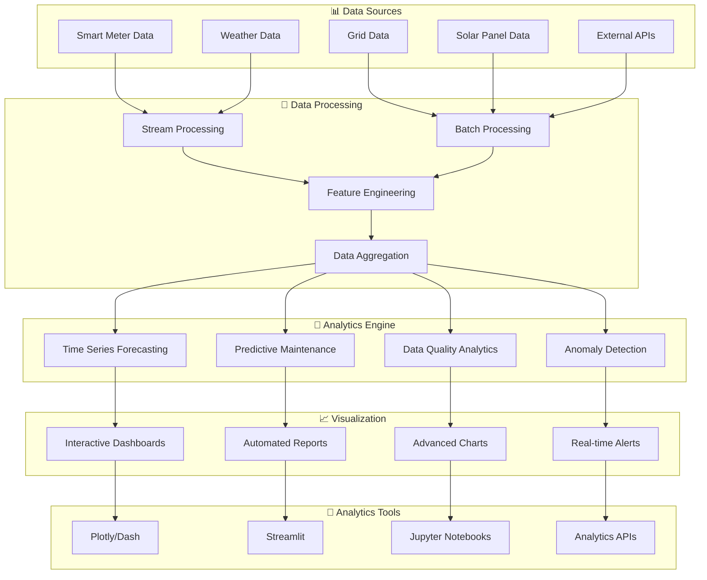

# Advanced Analytics - Overview

The Metrify Smart Metering Platform provides comprehensive advanced analytics capabilities for energy forecasting, anomaly detection, predictive maintenance, and interactive visualizations.

## 📊 Analytics Architecture



## 🎯 Analytics Capabilities

### 1. Time Series Forecasting
- **Energy Consumption**: Predict future energy usage
- **Demand Forecasting**: Grid demand prediction
- **Renewable Generation**: Solar/wind power forecasting
- **Price Forecasting**: Energy price prediction

### 2. Anomaly Detection
- **Real-time Detection**: Immediate anomaly identification
- **Pattern Recognition**: Complex pattern anomaly detection
- **Multivariate Analysis**: Multi-dimensional anomaly detection
- **Root Cause Analysis**: Automated root cause identification

### 3. Predictive Maintenance
- **Equipment Health**: Predict equipment failures
- **Maintenance Scheduling**: Optimal maintenance windows
- **Risk Assessment**: Equipment risk scoring
- **Cost Optimization**: Maintenance cost minimization

### 4. Data Quality Analytics
- **Quality Scoring**: Comprehensive quality metrics
- **Trend Analysis**: Quality trend identification
- **Issue Prediction**: Proactive quality issue detection
- **Improvement Recommendations**: Data quality enhancement

## 🛠️ Technology Stack

### Core Analytics
- **Pandas**: Data manipulation and analysis
- **NumPy**: Numerical computing
- **SciPy**: Scientific computing
- **Statsmodels**: Statistical modeling

### Time Series
- **Prophet**: Facebook's time series forecasting
- **ARIMA**: AutoRegressive Integrated Moving Average
- **LSTM**: Long Short-Term Memory networks
- **XGBoost**: Gradient boosting for time series

### Visualization
- **Plotly**: Interactive visualizations
- **Dash**: Web applications for analytics
- **Streamlit**: Rapid analytics app development
- **Matplotlib**: Static plotting
- **Seaborn**: Statistical visualization

### Machine Learning
- **Scikit-learn**: Traditional ML algorithms
- **TensorFlow**: Deep learning
- **PyTorch**: Deep learning alternative
- **XGBoost**: Gradient boosting
- **LightGBM**: Light gradient boosting

## 📊 Analytics Components

### 1. Forecasting Engine
```python
from src.analytics.forecasting.energy_forecaster import EnergyForecaster

# Initialize forecaster
forecaster = EnergyForecaster()

# Train model
forecaster.train(
    data=historical_data,
    features=['consumption', 'temperature', 'time_of_day']
)

# Generate forecast
forecast = forecaster.predict(
    horizon=24,  # 24 hours ahead
    confidence_interval=0.95
)
```

### 2. Anomaly Detection
```python
from src.analytics.anomaly.multivariate_detector import MultivariateAnomalyDetector

# Initialize detector
detector = MultivariateAnomalyDetector()

# Detect anomalies
anomalies = detector.detect(
    data=real_time_data,
    sensitivity=0.1
)

# Get anomaly details
for anomaly in anomalies:
    print(f"Anomaly at {anomaly.timestamp}: {anomaly.description}")
```

### 3. Quality Analytics
```python
from src.analytics.quality.quality_analyzer import QualityAnalyzer

# Initialize analyzer
analyzer = QualityAnalyzer()

# Analyze data quality
quality_report = analyzer.analyze(
    data=dataset,
    metrics=['completeness', 'accuracy', 'consistency']
)

# Get quality score
print(f"Overall Quality Score: {quality_report.overall_score}")
```

### 4. Interactive Visualizations
```python
import plotly.graph_objects as go
from src.analytics.visualization.dashboard import AnalyticsDashboard

# Create dashboard
dashboard = AnalyticsDashboard()

# Add energy consumption chart
dashboard.add_consumption_chart(
    data=consumption_data,
    title="Energy Consumption Over Time"
)

# Add anomaly detection chart
dashboard.add_anomaly_chart(
    data=anomaly_data,
    title="Anomaly Detection Results"
)

# Generate dashboard
dashboard.generate()
```

## 📈 Analytics Types

### 1. Descriptive Analytics
- **Data Summarization**: Statistical summaries
- **Trend Analysis**: Historical trend identification
- **Pattern Recognition**: Data pattern discovery
- **Performance Metrics**: KPI calculation

### 2. Diagnostic Analytics
- **Root Cause Analysis**: Problem identification
- **Drill-down Analysis**: Detailed investigation
- **Correlation Analysis**: Relationship identification
- **Variance Analysis**: Deviation analysis

### 3. Predictive Analytics
- **Forecasting**: Future value prediction
- **Classification**: Category prediction
- **Regression**: Continuous value prediction
- **Time Series**: Temporal pattern prediction

### 4. Prescriptive Analytics
- **Optimization**: Optimal solution finding
- **Recommendation**: Action recommendations
- **Simulation**: Scenario modeling
- **Decision Support**: Decision assistance

## 🔄 Analytics Pipeline

### 1. Data Ingestion
```python
# Real-time data streaming
from src.analytics.ingestion.stream_processor import StreamProcessor

processor = StreamProcessor()
processor.consume_from_kafka(
    topic="smart_meter_readings",
    handler=analytics_handler
)
```

### 2. Feature Engineering
```python
# Feature creation and transformation
from src.analytics.features.feature_engineer import FeatureEngineer

engineer = FeatureEngineer()
features = engineer.create_features(
    data=raw_data,
    feature_types=['temporal', 'statistical', 'lagged']
)
```

### 3. Model Training
```python
# Model training and validation
from src.analytics.models.model_trainer import ModelTrainer

trainer = ModelTrainer()
model = trainer.train(
    data=training_data,
    model_type="lstm",
    validation_split=0.2
)
```

### 4. Model Deployment
```python
# Model serving and deployment
from src.analytics.serving.model_serving import ModelServing

serving = ModelServing()
serving.deploy_model(
    model=model,
    endpoint="energy_forecast",
    version="1.0"
)
```

## 📊 Visualization Types

### 1. Time Series Charts
- **Line Charts**: Time series data visualization
- **Area Charts**: Cumulative data representation
- **Candlestick Charts**: OHLC data visualization
- **Heatmaps**: Temporal pattern visualization

### 2. Statistical Charts
- **Histograms**: Distribution visualization
- **Box Plots**: Statistical summary visualization
- **Scatter Plots**: Correlation visualization
- **Violin Plots**: Distribution comparison

### 3. Geographic Charts
- **Choropleth Maps**: Geographic data visualization
- **Scatter Maps**: Location-based data
- **Heat Maps**: Geographic density visualization
- **Flow Maps**: Data flow visualization

### 4. Interactive Dashboards
- **Real-time Dashboards**: Live data visualization
- **Drill-down Dashboards**: Hierarchical data exploration
- **Comparative Dashboards**: Multi-dataset comparison
- **Alert Dashboards**: Anomaly and alert visualization

## 🚀 Getting Started

### 1. Setup Analytics Environment
```bash
# Install analytics dependencies
pip install -r requirements.txt

# Start Jupyter notebook
jupyter notebook

# Start Streamlit app
streamlit run src/analytics/dashboard/app.py
```

### 2. Run Your First Analysis
```python
# Load data
from src.analytics.data.data_loader import DataLoader
loader = DataLoader()
data = loader.load_smart_meter_data()

# Create forecast
from src.analytics.forecasting.energy_forecaster import EnergyForecaster
forecaster = EnergyForecaster()
forecast = forecaster.forecast(data, horizon=24)

# Visualize results
import plotly.graph_objects as go
fig = go.Figure()
fig.add_trace(go.Scatter(x=data.index, y=data.consumption, name='Historical'))
fig.add_trace(go.Scatter(x=forecast.index, y=forecast.prediction, name='Forecast'))
fig.show()
```

### 3. Create Interactive Dashboard
```python
# Create Streamlit dashboard
import streamlit as st
from src.analytics.dashboard.energy_dashboard import EnergyDashboard

st.title("Metrify Energy Analytics Dashboard")
dashboard = EnergyDashboard()

# Add components
dashboard.add_consumption_chart()
dashboard.add_forecast_chart()
dashboard.add_anomaly_chart()
dashboard.add_quality_metrics()
```

## 📈 Performance Optimization

### 1. Data Processing
- **Parallel Processing**: Multi-core data processing
- **Memory Optimization**: Efficient memory usage
- **Caching**: Intelligent data caching
- **Compression**: Data compression techniques

### 2. Model Performance
- **Model Optimization**: Model size and speed optimization
- **Batch Processing**: Efficient batch processing
- **GPU Acceleration**: GPU-accelerated computing
- **Model Quantization**: Model size reduction

### 3. Visualization Performance
- **Data Sampling**: Large dataset sampling
- **Lazy Loading**: On-demand data loading
- **Caching**: Visualization result caching
- **Progressive Rendering**: Incremental visualization

## 📚 Additional Resources

- [Forecasting Guide](forecasting-guide.md)
- [Anomaly Detection Guide](anomaly-detection-guide.md)
- [Visualization Guide](visualization-guide.md)
- [Dashboard Development](dashboard-development.md)
- [Performance Optimization](performance-optimization.md)
