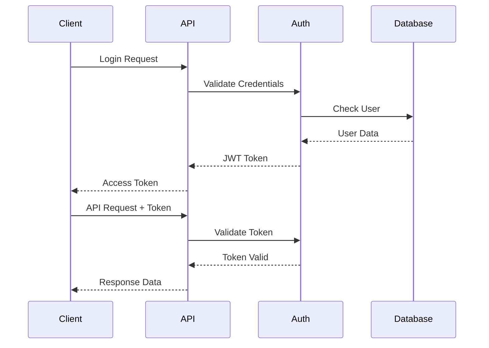
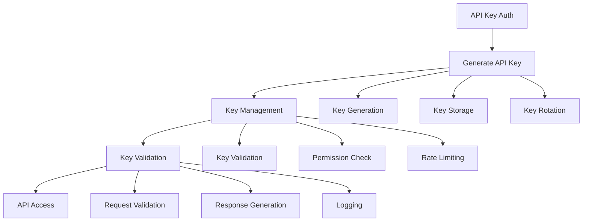
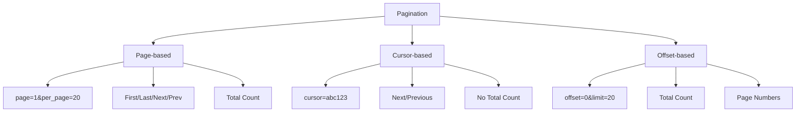
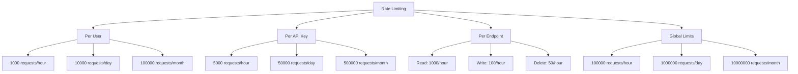
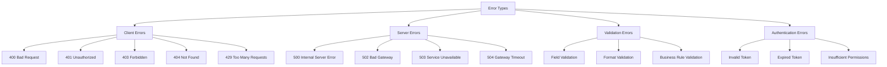
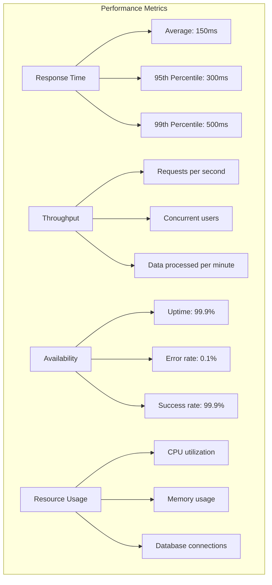
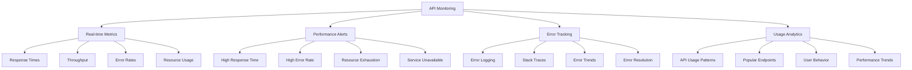
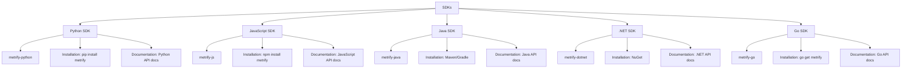

# API Overview

The Metrify Smart Metering API provides comprehensive access to smart meter data, grid operator information, weather data, and analytics. This RESTful API is designed for developers, data analysts, and system integrators.

## 🎯 API Overview

The Metrify API is built on modern REST principles and provides:
- **RESTful endpoints** for all data operations
- **JSON-based** request and response formats
- **Comprehensive authentication** and authorization
- **Rate limiting** and throttling
- **Real-time data** access and streaming
- **Comprehensive documentation** with examples

## 🔗 Base URL and Versioning

### Base URLs
- **Production**: `https://api.metrify.com/v1`
- **Staging**: `https://staging-api.metrify.com/v1`
- **Development**: `https://dev-api.metrify.com/v1`

### API Versioning
- **Current Version**: v1
- **Version Header**: `Accept: application/vnd.metrify.v1+json`
- **URL Versioning**: `/v1/endpoint`
- **Backward Compatibility**: Maintained for 12 months

## 🔐 Authentication and Authorization

### Authentication Flow



### Authentication Methods

#### 1. JWT Token Authentication
```mermaid
graph TB
    A[JWT Authentication] --> B[Login Endpoint]
    B --> C[Username/Password]
    C --> D[Token Generation]
    D --> E[Access Token]
    E --> F[API Requests]
    
    B --> G[/auth/login]
    C --> H[Basic Auth]
    C --> I[OAuth 2.0]
    C --> J[API Key]
    
    D --> K[JWT Token]
    D --> L[Refresh Token]
    D --> M[Expiration Time]
    
    E --> N[Authorization Header]
    E --> O[Bearer Token]
    E --> P[Token Validation]
```

#### 2. API Key Authentication


### Authorization Levels

| Level | Description | Access |
|-------|-------------|--------|
| **Admin** | Full system access | All endpoints and operations |
| **Analyst** | Data analysis access | Read access to all data |
| **Operator** | Operational access | Read/write access to operational data |
| **Viewer** | Read-only access | Read access to public data |
| **API** | Programmatic access | Specific API endpoints |

## 📊 API Endpoints Overview

### Smart Meter Endpoints

```mermaid
graph TB
    subgraph "Smart Meter API"
        A[/smart-meters] --> B[GET /smart-meters]
        A --> C[POST /smart-meters]
        A --> D[PUT /smart-meters/{id}]
        A --> E[DELETE /smart-meters/{id}]
        
        F[/smart-meters/{id}/readings] --> G[GET /readings]
        F --> H[POST /readings]
        F --> I[PUT /readings/{id}]
        F --> J[DELETE /readings/{id}]
        
        K[/smart-meters/{id}/analytics] --> L[GET /analytics]
        K --> M[POST /analytics]
        K --> N[GET /analytics/trends]
        K --> O[GET /analytics/forecasts]
    end
```

### Grid Operator Endpoints

```mermaid
graph TB
    subgraph "Grid Operator API"
        A[/grid-operators] --> B[GET /grid-operators]
        A --> C[POST /grid-operators]
        A --> D[PUT /grid-operators/{id}]
        A --> E[DELETE /grid-operators/{id}]
        
        F[/grid-operators/{id}/status] --> G[GET /status]
        F --> H[POST /status]
        F --> I[PUT /status/{id}]
        F --> J[DELETE /status/{id}]
        
        K[/grid-operators/{id}/analytics] --> L[GET /analytics]
        K --> M[POST /analytics]
        K --> N[GET /analytics/performance]
        K --> O[GET /analytics/stability]
    end
```

### Weather Endpoints

```mermaid
graph TB
    subgraph "Weather API"
        A[/weather-stations] --> B[GET /weather-stations]
        A --> C[POST /weather-stations]
        A --> D[PUT /weather-stations/{id}]
        A --> E[DELETE /weather-stations/{id}]
        
        F[/weather-stations/{id}/observations] --> G[GET /observations]
        F --> H[POST /observations]
        F --> I[PUT /observations/{id}]
        F --> J[DELETE /observations/{id}]
        
        K[/weather-stations/{id}/forecasts] --> L[GET /forecasts]
        K --> M[POST /forecasts]
        K --> N[GET /forecasts/current]
        K --> O[GET /forecasts/extended]
    end
```

### Analytics Endpoints

```mermaid
graph TB
    subgraph "Analytics API"
        A[/analytics] --> B[GET /analytics/overview]
        A --> C[GET /analytics/consumption]
        A --> D[GET /analytics/quality]
        A --> E[GET /analytics/performance]
        
        F[/analytics/reports] --> G[GET /reports]
        F --> H[POST /reports]
        F --> I[GET /reports/{id}]
        F --> J[DELETE /reports/{id}]
        
        K[/analytics/dashboards] --> L[GET /dashboards]
        K --> M[POST /dashboards]
        K --> N[GET /dashboards/{id}]
        K --> O[PUT /dashboards/{id}]
    end
```

## 📝 Request and Response Formats

### Request Format

#### Headers
```http
Content-Type: application/json
Authorization: Bearer <jwt_token>
Accept: application/vnd.metrify.v1+json
X-API-Key: <api_key>
X-Request-ID: <unique_request_id>
```

#### Request Body
```json
{
  "data": {
    "type": "smart-meter",
    "attributes": {
      "meter_id": "SM-001-2024",
      "location": {
        "latitude": 40.7128,
        "longitude": -74.0060,
        "address": "123 Main St, New York, NY"
      },
      "specifications": {
        "voltage_rating": "230V",
        "current_rating": "60A",
        "accuracy_class": "Class 1"
      }
    }
  }
}
```

### Response Format

#### Success Response
```json
{
  "data": {
    "id": "SM-001-2024",
    "type": "smart-meter",
    "attributes": {
      "meter_id": "SM-001-2024",
      "location": {
        "latitude": 40.7128,
        "longitude": -74.0060,
        "address": "123 Main St, New York, NY"
      },
      "specifications": {
        "voltage_rating": "230V",
        "current_rating": "60A",
        "accuracy_class": "Class 1"
      },
      "created_at": "2024-01-20T10:30:00Z",
      "updated_at": "2024-01-20T10:30:00Z"
    },
    "relationships": {
      "readings": {
        "data": [
          {
            "id": "reading-001",
            "type": "meter-reading"
          }
        ]
      }
    }
  },
  "meta": {
    "total": 1,
    "page": 1,
    "per_page": 20
  },
  "links": {
    "self": "/v1/smart-meters/SM-001-2024",
    "related": "/v1/smart-meters/SM-001-2024/readings"
  }
}
```

#### Error Response
```json
{
  "errors": [
    {
      "id": "validation-error-001",
      "status": "400",
      "code": "VALIDATION_ERROR",
      "title": "Validation Error",
      "detail": "The meter_id field is required",
      "source": {
        "pointer": "/data/attributes/meter_id"
      }
    }
  ],
  "meta": {
    "request_id": "req-123456789",
    "timestamp": "2024-01-20T10:30:00Z"
  }
}
```

## 🔄 Pagination and Filtering

### Pagination



### Filtering

```mermaid
graph TB
    A[Filtering] --> B[Field Filters]
    A --> C[Date Range Filters]
    A --> D[Geographic Filters]
    A --> E[Quality Filters]
    
    B --> F[?filter[meter_id]=SM-001]
    B --> G[?filter[status]=active]
    B --> H[?filter[quality_tier]=excellent]
    
    C --> I[?filter[date_from]=2024-01-01]
    C --> J[?filter[date_to]=2024-01-31]
    C --> K[?filter[time_range]=last_30_days]
    
    D --> L[?filter[latitude]=40.7128]
    D --> M[?filter[longitude]=-74.0060]
    D --> N[?filter[radius]=10km]
    
    E --> O[?filter[quality_score_min]=80]
    E --> P[?filter[quality_score_max]=100]
    E --> Q[?filter[anomaly]=false]
```

## 📊 Rate Limiting and Throttling

### Rate Limits



### Throttling Headers

```http
X-RateLimit-Limit: 1000
X-RateLimit-Remaining: 999
X-RateLimit-Reset: 1642680000
X-RateLimit-Retry-After: 3600
```

## 🔍 Error Handling

### Error Types



### Error Response Format

```json
{
  "errors": [
    {
      "id": "error-001",
      "status": "400",
      "code": "VALIDATION_ERROR",
      "title": "Validation Error",
      "detail": "The meter_id field is required",
      "source": {
        "pointer": "/data/attributes/meter_id"
      },
      "meta": {
        "field": "meter_id",
        "value": null,
        "constraint": "required"
      }
    }
  ],
  "meta": {
    "request_id": "req-123456789",
    "timestamp": "2024-01-20T10:30:00Z",
    "version": "v1"
  }
}
```

## 📈 API Performance and Monitoring

### Performance Metrics



### Monitoring and Alerting



## 🔧 SDKs and Client Libraries

### Available SDKs



### SDK Features

- **Authentication handling** - Automatic token management
- **Request/response serialization** - JSON handling
- **Error handling** - Comprehensive error management
- **Retry logic** - Automatic retry with exponential backoff
- **Rate limiting** - Built-in rate limit handling
- **Caching** - Response caching for better performance
- **Logging** - Comprehensive logging and debugging

## 📚 API Documentation

### Interactive Documentation

- **Swagger UI**: Interactive API documentation
- **OpenAPI Specification**: Machine-readable API spec
- **Postman Collection**: Ready-to-use API collection
- **Code Examples**: Real-world usage examples

### Documentation Features

- **Live API testing** - Test endpoints directly
- **Code generation** - Generate client code
- **Schema validation** - Validate request/response schemas
- **Interactive examples** - Try API calls in browser

## 📞 Support and Resources

### API Support

- **Technical Support**: api-support@metrify.com
- **Documentation**: API documentation and guides
- **Community Forum**: Developer discussions and tips
- **Status Page**: API status and uptime information

### Resources

- **API Reference**: Complete endpoint documentation
- **Getting Started Guide**: Quick start tutorial
- **Best Practices**: API usage recommendations
- **Changelog**: API version changes and updates

### Support Channels

- **Email Support**: api-support@metrify.com
- **Slack Community**: #metrify-api
- **GitHub Issues**: Bug reports and feature requests
- **Stack Overflow**: Community Q&A

This API overview provides a comprehensive introduction to the Metrify Smart Metering API. For detailed endpoint documentation and examples, please refer to the specific API reference guides.
