# Data Flow Architecture

This document provides a comprehensive overview of how data flows through the Metrify Smart Metering system, from initial collection to final analytics and reporting.

## 🔄 End-to-End Data Flow

```mermaid
flowchart TD
    subgraph "Data Sources"
        A[Smart Meters<br/>📊 Energy Consumption]
        B[Grid Operators<br/>⚡ Grid Status]
        C[Weather Stations<br/>🌤️ Environmental Data]
    end
    
    subgraph "Data Ingestion"
        D[Kafka Topics<br/>📨 Real-time Streaming]
        E[REST API<br/>🌐 HTTP Endpoints]
        F[CLI Tools<br/>💻 Command Line]
    end
    
    subgraph "Stream Processing"
        G[Data Validation<br/>✅ Quality Checks]
        H[Anomaly Detection<br/>🚨 ML Models]
        I[Data Enrichment<br/>🔍 Business Logic]
    end
    
    subgraph "Storage Layer"
        J[PostgreSQL<br/>🗄️ Operational DB]
        K[AWS S3<br/>☁️ Data Lake]
        L[Redis Cache<br/>⚡ Fast Access]
    end
    
    subgraph "Batch Processing"
        M[Airflow DAGs<br/>⏰ Scheduled Jobs]
        N[dbt Transformations<br/>🔄 Data Modeling]
        O[Snowflake<br/>📊 Data Warehouse]
    end
    
    subgraph "Analytics & Reporting"
        P[Grafana Dashboards<br/>📈 Real-time Views]
        Q[Business Intelligence<br/>💡 Insights]
        R[API Endpoints<br/>🔌 Data Access]
    end
    
    A --> D
    B --> D
    C --> D
    A --> E
    B --> E
    C --> E
    A --> F
    B --> F
    C --> F
    
    D --> G
    E --> G
    F --> G
    G --> H
    H --> I
    I --> J
    I --> K
    I --> L
    
    J --> M
    K --> M
    M --> N
    N --> O
    
    J --> P
    O --> P
    O --> Q
    J --> R
    O --> R
```

## 📊 Smart Meter Data Flow

## ⚡ Grid Operator Data Flow

## 🌤️ Weather Data Flow

## 🔄 Data Quality Flow

## 📈 Analytics Data Flow

## 🔄 Error Handling Flow

## 📊 Monitoring Data Flow

## 🔄 Data Retention Flow

## 🎯 Key Data Flow Characteristics

### Real-time Processing
- **Latency**: < 1 second for data validation
- **Throughput**: 1M+ records per minute
- **Availability**: 99.9% uptime

### Batch Processing
- **Frequency**: Hourly, daily, weekly schedules
- **Volume**: 100GB+ per processing cycle
- **Duration**: < 30 minutes per batch

### Data Quality
- **Validation**: 100% of incoming data
- **Accuracy**: 99.9% data accuracy
- **Completeness**: 99.5% data completeness

### Storage Efficiency
- **Compression**: 70% average compression ratio
- **Deduplication**: 90% duplicate elimination
- **Cost Optimization**: 60% storage cost reduction

This data flow architecture ensures reliable, scalable, and efficient processing of smart meter data throughout the entire pipeline, from collection to analytics and reporting.
