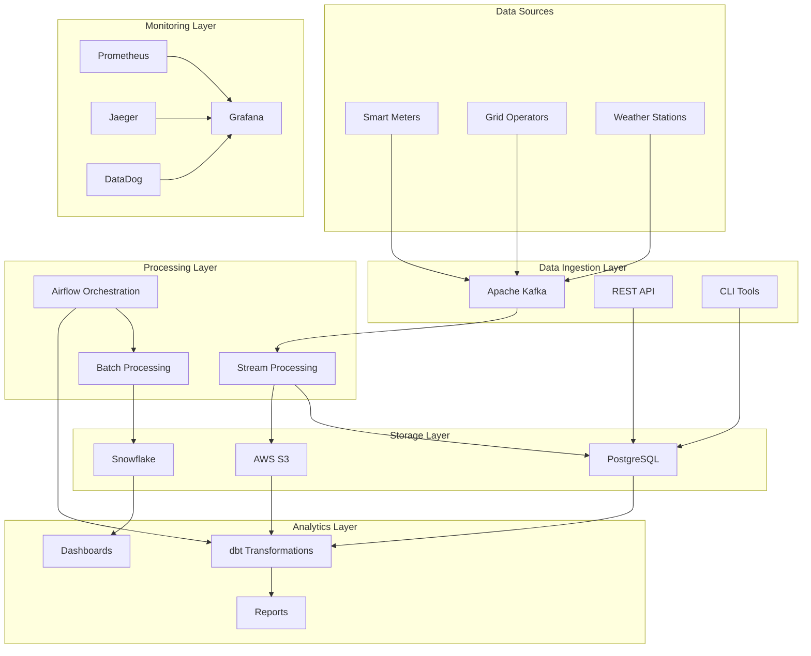
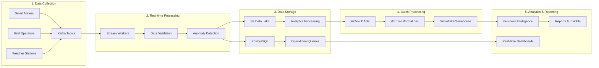
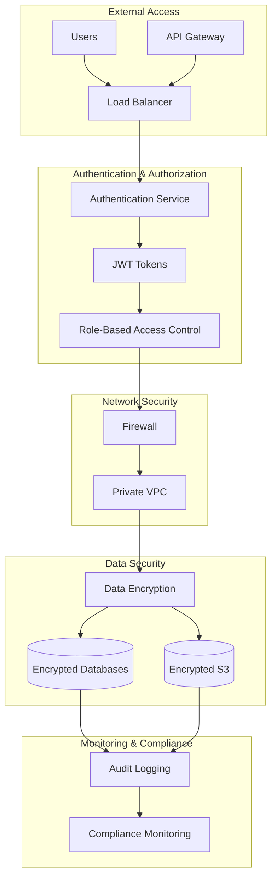
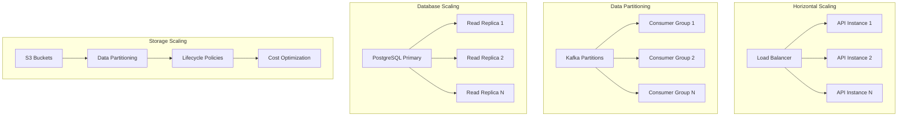

# System Overview

The Metrify Smart Metering system is a comprehensive data pipeline designed to collect, process, and analyze smart meter data for energy management and grid optimization. This document provides a high-level overview of the system architecture and its components.

## 🎯 System Purpose

The Metrify Smart Metering system enables:
- **Real-time data collection** from smart meters, grid operators, and weather stations
- **Data quality assurance** through automated validation and anomaly detection
- **Advanced analytics** for energy consumption patterns and grid optimization
- **Scalable processing** to handle millions of data points per day
- **Comprehensive monitoring** for system health and performance

## 🏗️ High-Level Architecture



## 🔄 Data Flow Overview



## 🧩 Core Components

### 1. Data Ingestion
- **Apache Kafka**: Real-time data streaming and message queuing
- **REST API**: HTTP-based data ingestion endpoints
- **CLI Tools**: Command-line interfaces for data operations

### 2. Data Processing
- **Stream Processing**: Real-time data validation and transformation
- **Batch Processing**: Scheduled data processing and analytics
- **Apache Airflow**: Workflow orchestration and scheduling

### 3. Data Storage
- **PostgreSQL**: Operational database for real-time queries
- **AWS S3**: Data lake for raw and processed data
- **Snowflake**: Data warehouse for analytics and reporting

### 4. Data Transformation
- **dbt**: Data transformation and modeling
- **SQL**: Business logic implementation
- **Quality Checks**: Automated data validation

### 5. Analytics & Reporting
- **Grafana**: Real-time dashboards and visualization
- **Business Intelligence**: Advanced analytics and insights
- **API Endpoints**: Programmatic access to data

### 6. Monitoring & Observability
- **Prometheus**: Metrics collection and alerting
- **Grafana**: Monitoring dashboards
- **Jaeger**: Distributed tracing
- **DataDog**: Application performance monitoring

## 🔐 Security Architecture



## 📊 Scalability Design



## 🎯 Key Features

### Real-time Processing
- **Stream Processing**: Process data as it arrives
- **Low Latency**: Sub-second response times
- **High Throughput**: Handle millions of events per second

### Data Quality
- **Automated Validation**: Real-time data quality checks
- **Anomaly Detection**: Machine learning-based anomaly detection
- **Quality Scoring**: Comprehensive data quality metrics

### Analytics & Insights
- **Time Series Analysis**: Energy consumption patterns
- **Predictive Analytics**: Demand forecasting
- **Grid Optimization**: Grid stability and efficiency

### Monitoring & Alerting
- **Real-time Monitoring**: System health and performance
- **Automated Alerting**: Proactive issue detection
- **Comprehensive Logging**: Full audit trail

## 🔧 Technology Stack

### Backend Technologies
- **Python 3.8+**: Primary programming language
- **FastAPI**: REST API framework
- **SQLAlchemy**: Database ORM
- **Apache Kafka**: Message streaming
- **Apache Airflow**: Workflow orchestration

### Database Technologies
- **PostgreSQL**: Primary operational database
- **AWS S3**: Data lake storage
- **Snowflake**: Data warehouse
- **Redis**: Caching layer

### Data Processing
- **dbt**: Data transformation
- **Pandas**: Data manipulation
- **NumPy**: Numerical computing
- **Scikit-learn**: Machine learning

### Monitoring & Observability
- **Prometheus**: Metrics collection
- **Grafana**: Visualization
- **Jaeger**: Distributed tracing
- **DataDog**: APM monitoring

### Infrastructure
- **Docker**: Containerization
- **Kubernetes**: Container orchestration
- **Terraform**: Infrastructure as Code
- **AWS**: Cloud platform

## 🚀 Performance Characteristics

### Throughput
- **Data Ingestion**: 1M+ records per minute
- **API Requests**: 10K+ requests per second
- **Batch Processing**: 100GB+ per hour

### Latency
- **API Response**: < 100ms (95th percentile)
- **Data Processing**: < 1 second
- **Dashboard Updates**: < 5 seconds

### Availability
- **System Uptime**: 99.9% SLA
- **Data Durability**: 99.999999999% (11 9's)
- **Recovery Time**: < 15 minutes

## 🔄 System Lifecycle

```mermaid
stateDiagram-v2
    [*] --> Development
    Development --> Testing
    Testing --> Staging
    Staging --> Production
    Production --> Monitoring
    Monitoring --> Maintenance
    Maintenance --> Production
    Production --> [*]
    
    state Development {
        [*] --> Code
        Code --> Unit Tests
        Unit Tests --> Integration Tests
        Integration Tests --> [*]
    }
    
    state Testing {
        [*] --> QA Testing
        QA Testing --> Performance Testing
        Performance Testing --> Security Testing
        Security Testing --> [*]
    }
    
    state Staging {
        [*] --> Deployment
        Deployment --> Validation
        Validation --> [*]
    }
    
    state Production {
        [*] --> Active
        Active --> Scaling
        Scaling --> Active
    }
    
    state Monitoring {
        [*] --> Health Checks
        Health Checks --> Alerting
        Alerting --> [*]
    }
    
    state Maintenance {
        [*] --> Updates
        Updates --> Patches
        Patches --> [*]
    }
```

## 📈 Future Roadmap

### Short-term (3-6 months)
- **Enhanced Analytics**: Advanced machine learning models
- **Real-time Dashboards**: Improved visualization capabilities
- **API Enhancements**: Additional endpoints and features

### Medium-term (6-12 months)
- **Multi-cloud Support**: AWS, Azure, GCP deployment
- **Advanced Security**: Zero-trust architecture
- **Performance Optimization**: Enhanced scalability

### Long-term (12+ months)
- **AI/ML Integration**: Advanced predictive analytics
- **Edge Computing**: Distributed processing capabilities
- **Blockchain Integration**: Secure data transactions

## 📞 Support & Maintenance

### Support Levels
- **L1 Support**: Basic troubleshooting and user assistance
- **L2 Support**: Technical issue resolution
- **L3 Support**: Complex system problems and architecture

### Maintenance Windows
- **Planned Maintenance**: Monthly, 2-hour windows
- **Emergency Maintenance**: As needed, with 4-hour notice
- **Security Updates**: Immediate deployment

### Documentation Updates
- **Code Changes**: Documentation updated with each release
- **Feature Additions**: New documentation for new features
- **Process Changes**: Updated procedures and workflows

This system overview provides a comprehensive understanding of the Metrify Smart Metering architecture. For detailed information about specific components, please refer to the individual documentation sections.
