# Deployment Overview

This guide provides a comprehensive overview of deployment strategies, environments, and processes for the Metrify Smart Metering system. Learn how to deploy the system in different environments and configurations.

## 🎯 Deployment Strategy

The Metrify Smart Metering system supports multiple deployment strategies to meet different requirements:

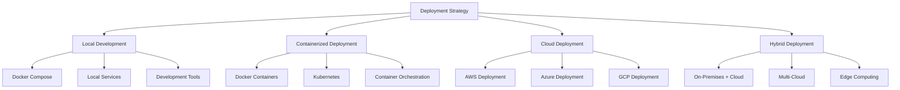

## 🏗️ Architecture Overview

### System Components

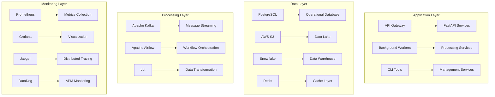

### Deployment Environments

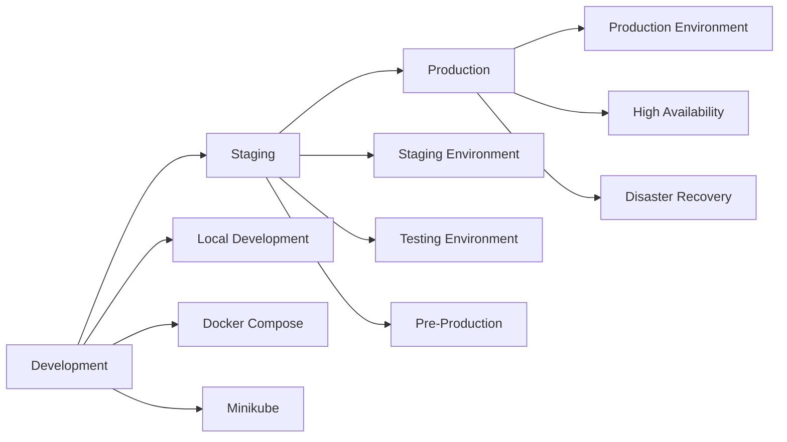

## 🚀 Deployment Options

### 1. Local Development Deployment

#### Docker Compose Setup
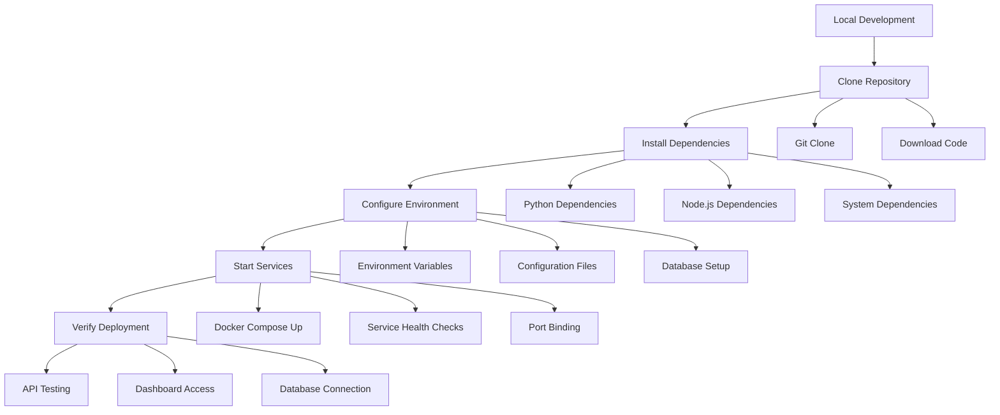

#### Prerequisites
- **Docker**: Version 20.10+
- **Docker Compose**: Version 2.0+
- **Git**: Version 2.30+
- **Python**: Version 3.8+
- **Node.js**: Version 16+

#### Quick Start
```bash
# Clone repository
git clone https://github.com/metrify/smart-metering.git
cd smart-metering

# Start services
docker-compose up -d

# Verify deployment
curl http://localhost:8000/health
```

### 2. Containerized Deployment

#### Docker Deployment
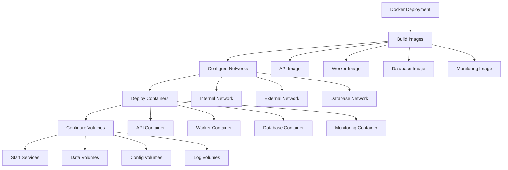

#### Kubernetes Deployment
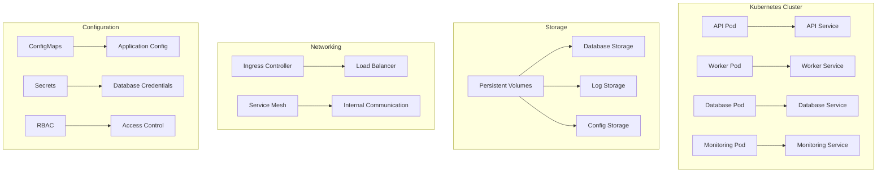

### 3. Cloud Deployment

#### AWS Deployment
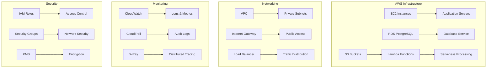

#### Azure Deployment
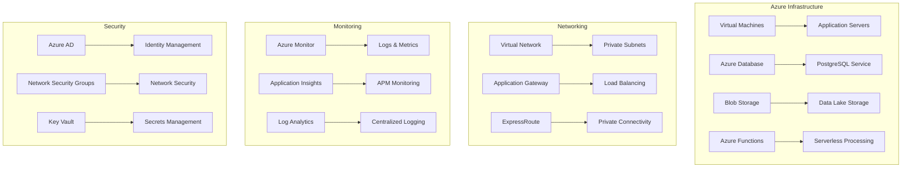

## 🔧 Deployment Process

### 1. Pre-Deployment Checklist

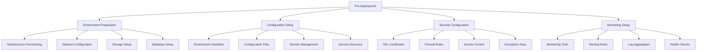

### 2. Deployment Steps

#### Step 1: Infrastructure Setup
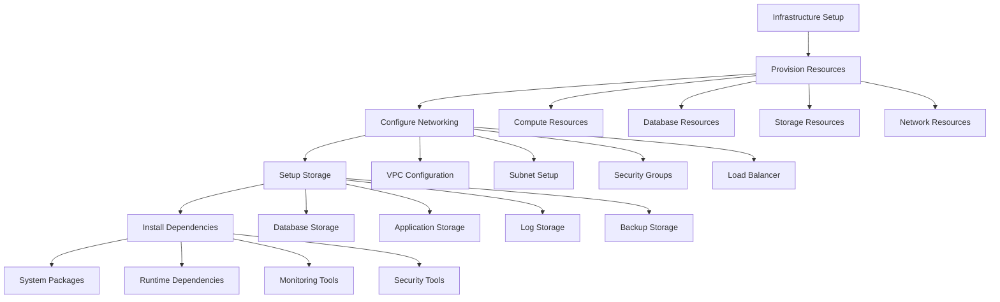

#### Step 2: Application Deployment
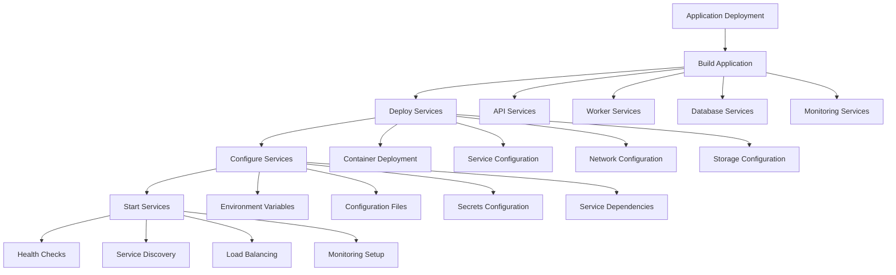

#### Step 3: Post-Deployment Verification
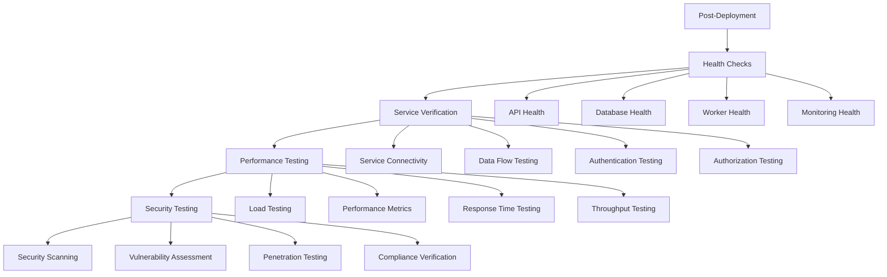

## 📊 Deployment Monitoring

### Monitoring Dashboard

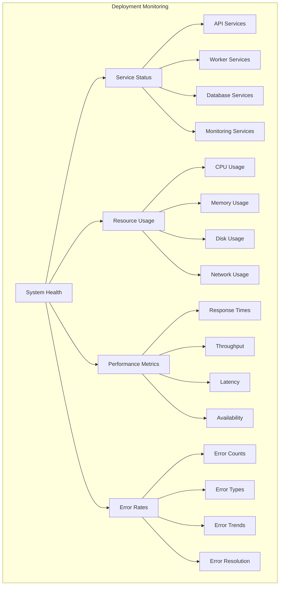

### Key Metrics to Monitor

| Metric | Description | Threshold | Action Required |
|--------|-------------|-----------|-----------------|
| **CPU Usage** | Average CPU utilization | > 80% | Scale up resources |
| **Memory Usage** | Average memory utilization | > 85% | Increase memory |
| **Disk Usage** | Disk space utilization | > 90% | Clean up or expand |
| **Response Time** | API response time | > 500ms | Optimize performance |
| **Error Rate** | Percentage of failed requests | > 5% | Investigate errors |
| **Availability** | Service uptime percentage | < 99% | Check service health |

## 🔒 Security Considerations

### Security Checklist

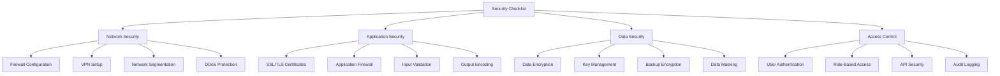

### Security Best Practices

1. **Network Security**
   - Use private subnets for internal services
   - Implement network segmentation
   - Configure firewall rules
   - Enable DDoS protection

2. **Application Security**
   - Use HTTPS for all communications
   - Implement input validation
   - Regular security updates
   - Code security scanning

3. **Data Security**
   - Encrypt data at rest and in transit
   - Implement key management
   - Regular security audits
   - Data backup and recovery

4. **Access Control**
   - Multi-factor authentication
   - Role-based access control
   - Regular access reviews
   - Audit logging

## 📈 Scaling and Performance

### Horizontal Scaling

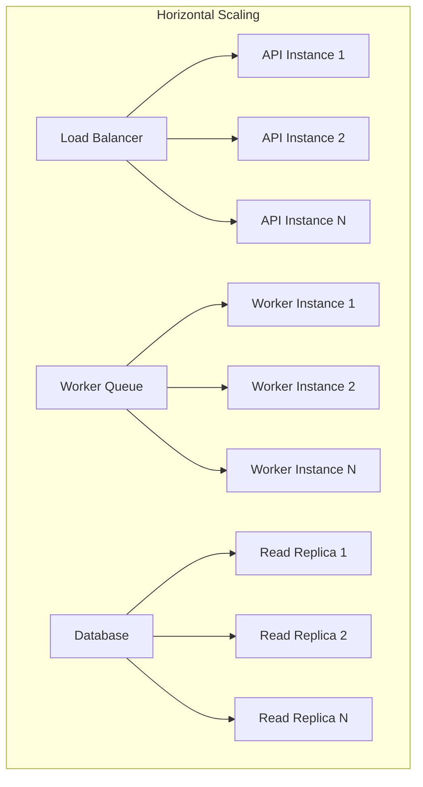

### Vertical Scaling

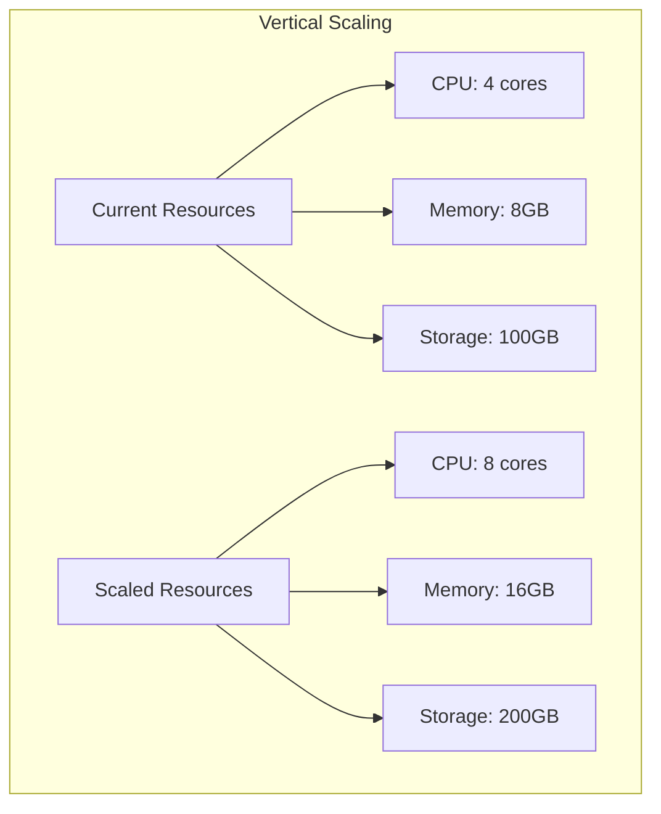

### Performance Optimization

1. **Database Optimization**
   - Index optimization
   - Query optimization
   - Connection pooling
   - Caching strategies

2. **Application Optimization**
   - Code optimization
   - Memory management
   - Async processing
   - Caching implementation

3. **Infrastructure Optimization**
   - Resource allocation
   - Network optimization
   - Storage optimization
   - Monitoring optimization

## 🔄 Deployment Automation

### CI/CD Pipeline

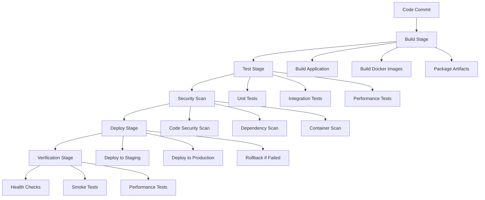

### Infrastructure as Code

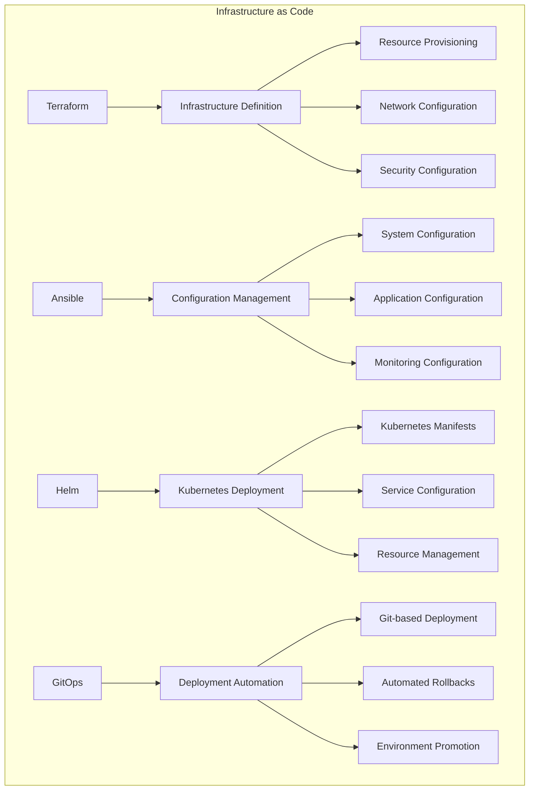

## 📞 Support and Troubleshooting

### Deployment Support

- **Technical Support**: deployment@metrify.com
- **Documentation**: Deployment guides and troubleshooting
- **Community Forum**: User discussions and tips
- **Emergency Support**: 24/7 for critical issues

### Common Issues

1. **Service Startup Issues**
   - Check configuration files
   - Verify environment variables
   - Check service dependencies
   - Review error logs

2. **Database Connection Issues**
   - Verify database credentials
   - Check network connectivity
   - Verify database status
   - Check firewall rules

3. **Performance Issues**
   - Monitor resource usage
   - Check application logs
   - Verify configuration
   - Scale resources if needed

4. **Security Issues**
   - Review security configuration
   - Check access controls
   - Verify encryption settings
   - Update security patches

This deployment overview provides a comprehensive guide for deploying the Metrify Smart Metering system in various environments. For detailed deployment instructions, please refer to the specific deployment guides for each environment.
