# Data Governance - Overview

The Metrify Smart Metering Platform implements comprehensive data governance to ensure data quality, compliance, lineage tracking, and regulatory adherence.

## 🏛️ Governance Architecture

```mermaid
graph TB
    subgraph "📊 Data Sources"
        SM[Smart Meters]
        GRID[Grid Operators]
        WEATHER[Weather Stations]
        SOLAR[Solar Panels]
    end
    
    subgraph "🔍 Data Discovery"
        CATALOG[Data Catalog]
        LINEAGE[Data Lineage]
        METADATA[Metadata Management]
        CLASSIFICATION[Data Classification]
    end
    
    subgraph "🛡️ Data Protection"
        PII[PII Detection]
        MASKING[Data Masking]
        ENCRYPTION[Encryption]
        ACCESS[Access Control]
    end
    
    subgraph "📋 Compliance"
        GDPR[GDPR Compliance]
        AUDIT[Audit Trails]
        RETENTION[Data Retention]
        CONSENT[Consent Management]
    end
    
    subgraph "🔧 Governance Tools"
        ATLAS[Apache Atlas]
        GREAT_EXPECTATIONS[Great Expectations]
        QUALITY[Data Quality]
        MONITORING[Governance Monitoring]
    end
    
    SM --> CATALOG
    GRID --> CATALOG
    WEATHER --> CATALOG
    SOLAR --> CATALOG
    
    CATALOG --> LINEAGE
    CATALOG --> METADATA
    CATALOG --> CLASSIFICATION
    
    LINEAGE --> PII
    METADATA --> PII
    CLASSIFICATION --> PII
    
    PII --> MASKING
    MASKING --> ENCRYPTION
    ENCRYPTION --> ACCESS
    
    ACCESS --> GDPR
    GDPR --> AUDIT
    AUDIT --> RETENTION
    RETENTION --> CONSENT
    
    CONSENT --> ATLAS
    ATLAS --> GREAT_EXPECTATIONS
    GREAT_EXPECTATIONS --> QUALITY
    QUALITY --> MONITORING
```



## 🎯 Governance Capabilities

### 1. Data Catalog & Discovery
- **Automated Discovery**: Automatic detection of data sources
- **Metadata Management**: Comprehensive metadata collection
- **Data Classification**: Automatic data classification and tagging
- **Search & Discovery**: Intelligent data search capabilities

### 2. Data Lineage Tracking
- **End-to-End Lineage**: Complete data flow tracking
- **Impact Analysis**: Understanding data dependencies
- **Change Tracking**: Monitoring data transformations
- **Visual Lineage**: Interactive lineage visualization

### 3. Data Quality Management
- **Automated Validation**: Real-time data quality checks
- **Quality Metrics**: Comprehensive quality scoring
- **Issue Detection**: Proactive quality issue identification
- **Remediation**: Automated quality issue resolution

### 4. Privacy & Compliance
- **PII Detection**: Automatic PII identification
- **Data Masking**: Sensitive data protection
- **GDPR Compliance**: European data protection compliance
- **Consent Management**: User consent tracking

## 🛠️ Technology Stack

### Data Catalog & Lineage
- **Apache Atlas**: Data catalog and lineage
- **Apache Ranger**: Data security and access control
- **Apache NiFi**: Data flow management
- **DataHub**: LinkedIn's data catalog

### Data Quality
- **Great Expectations**: Data validation framework
- **Apache Griffin**: Data quality service
- **Deequ**: Data quality library
- **Custom Quality Rules**: Business-specific validations

### Privacy & Security
- **Apache Ranger**: Access control and security
- **Apache Knox**: Security gateway
- **Vault**: Secret management
- **Custom PII Detection**: ML-based PII identification

### Compliance & Audit
- **Audit Logging**: Comprehensive audit trails
- **Retention Policies**: Automated data retention
- **Consent Management**: User consent tracking
- **Compliance Reporting**: Regulatory reporting

## 📊 Data Classification

### 1. Sensitivity Levels
- **Public**: Non-sensitive data
- **Internal**: Company-internal data
- **Confidential**: Sensitive business data
- **Restricted**: Highly sensitive data

### 2. Data Types
- **PII**: Personally Identifiable Information
- **PHI**: Protected Health Information
- **Financial**: Financial and payment data
- **Technical**: System and technical data

### 3. Compliance Categories
- **GDPR**: European data protection
- **CCPA**: California privacy law
- **SOX**: Sarbanes-Oxley compliance
- **Industry**: Energy sector regulations

## 🔍 Data Lineage

### 1. Source Tracking
```python
# Track data from source to destination
lineage = {
    "source": "smart_meter_kafka_topic",
    "transformations": [
        "data_validation",
        "anomaly_detection",
        "feature_engineering"
    ],
    "destinations": [
        "postgresql_operational_db",
        "snowflake_data_warehouse",
        "s3_data_lake"
    ]
}
```

### 2. Impact Analysis
- **Upstream Dependencies**: What data sources affect this dataset
- **Downstream Consumers**: What systems depend on this dataset
- **Change Impact**: Impact of schema or data changes
- **Data Freshness**: How current is the data

### 3. Visual Lineage
- **Interactive Diagrams**: Clickable lineage visualization
- **Filtering**: Filter by data type, system, or time
- **Search**: Find specific data elements
- **Export**: Export lineage for documentation

## 🛡️ Data Protection

### 1. PII Detection & Masking
```python
# Automatic PII detection and masking
pii_detector = PIIDetector()
masked_data = pii_detector.mask_sensitive_data(raw_data)

# Supported PII types
pii_types = [
    "email_address",
    "phone_number",
    "credit_card",
    "ssn",
    "address",
    "name"
]
```

### 2. Access Control
- **Role-Based Access**: Granular permission system
- **Data-Level Security**: Row and column level security
- **Audit Logging**: Complete access audit trail
- **Dynamic Masking**: Real-time data masking

### 3. Encryption
- **At Rest**: Database and file encryption
- **In Transit**: Network communication encryption
- **Key Management**: Centralized key management
- **Compliance**: FIPS 140-2 compliant encryption

## 📋 Compliance Management

### 1. GDPR Compliance
- **Data Subject Rights**: Access, rectification, erasure
- **Consent Management**: Granular consent tracking
- **Data Portability**: Export user data
- **Right to be Forgotten**: Data deletion

### 2. Audit & Reporting
```python
# Comprehensive audit logging
audit_log = {
    "timestamp": "2024-01-15T10:30:00Z",
    "user": "data_analyst@metrify.com",
    "action": "data_access",
    "resource": "smart_meter_readings",
    "sensitivity": "confidential",
    "compliance": "gdpr_compliant"
}
```

### 3. Data Retention
- **Retention Policies**: Automated data lifecycle
- **Legal Holds**: Compliance with legal requirements
- **Archive Management**: Long-term data storage
- **Deletion**: Secure data destruction

## 🔧 Implementation

### 1. Apache Atlas Setup
```yaml
# Atlas configuration
atlas:
  server:
    host: localhost
    port: 21000
  storage:
    backend: hbase
    hbase:
      zookeeper: localhost:2181
```

### 2. Great Expectations Integration
```python
# Data quality validation
import great_expectations as ge

# Create expectation suite
suite = ge.ExpectationSuite(expectation_suite_name="smart_meter_quality")

# Add expectations
suite.add_expectation(
    ge.expectations.ExpectColumnValuesToNotBeNull(
        column="meter_id"
    )
)

# Validate data
results = ge.validate(
    df=smart_meter_data,
    expectation_suite=suite
)
```

### 3. PII Detection
```python
# PII detection and masking
from src.governance.privacy.pii_detector import PIIDetector

detector = PIIDetector()
pii_scan_results = detector.scan_data(dataframe)

# Mask sensitive data
masked_data = detector.mask_pii(
    data=dataframe,
    masking_strategy="hash"  # or "replace", "encrypt"
)
```

## 📈 Monitoring & Metrics

### 1. Data Quality Metrics
- **Completeness**: Percentage of non-null values
- **Accuracy**: Data correctness validation
- **Consistency**: Cross-dataset consistency
- **Timeliness**: Data freshness metrics

### 2. Compliance Metrics
- **PII Coverage**: Percentage of PII detected and protected
- **Access Violations**: Unauthorized access attempts
- **Retention Compliance**: Data retention policy adherence
- **Audit Coverage**: Percentage of actions logged

### 3. Governance Dashboards
- **Data Quality Dashboard**: Real-time quality metrics
- **Compliance Dashboard**: Regulatory compliance status
- **Lineage Dashboard**: Data flow visualization
- **Security Dashboard**: Access and security metrics

## 🚀 Getting Started

### 1. Setup Governance Environment
```bash
# Start Apache Atlas
./atlas/bin/atlas_start.py

# Start Great Expectations
great_expectations init

# Configure data sources
great_expectations datasource new
```

### 2. Create Data Catalog
```python
from src.governance.catalog.data_catalog import DataCatalog

# Initialize catalog
catalog = DataCatalog()

# Register data source
catalog.register_source(
    name="smart_meters",
    type="kafka_topic",
    schema=schema,
    classification="confidential"
)
```

### 3. Setup Quality Rules
```python
from src.governance.quality.quality_manager import QualityManager

# Create quality rules
quality_manager = QualityManager()
quality_manager.create_rule(
    name="meter_id_not_null",
    expectation="expect_column_values_to_not_be_null",
    column="meter_id"
)
```

## 📚 Additional Resources

- [Data Catalog Guide](data-catalog.md)
- [Data Lineage Guide](data-lineage.md)
- [Privacy & Security Guide](privacy-security.md)
- [Compliance Guide](compliance.md)
- [Quality Management Guide](quality-management.md)
