# Machine Learning & AI - Overview

The Metrify Smart Metering Platform includes comprehensive ML/AI capabilities for predictive analytics, anomaly detection, and intelligent data processing.

## 🧠 ML Architecture

```mermaid
graph TB
    subgraph "📊 Data Sources"
        SM[Smart Meter Data]
        WEATHER[Weather Data]
        GRID[Grid Data]
        SOLAR[Solar Panel Data]
    end
    
    subgraph "🔄 Data Preparation"
        FEATURES[Feature Engineering]
        PREPROCESSING[Data Preprocessing]
        VALIDATION[Data Validation]
    end
    
    subgraph "🤖 ML Models"
        FORECAST[Energy Forecasting]
        ANOMALY[Anomaly Detection]
        MAINTENANCE[Predictive Maintenance]
        QUALITY[Data Quality ML]
    end
    
    subgraph "🏗️ ML Infrastructure"
        TENSORFLOW[TensorFlow]
        MLFLOW[MLflow]
        FEAST[Feast Feature Store]
        SERVING[Model Serving]
    end
    
    subgraph "📈 Monitoring"
        DRIFT[Data Drift Detection]
        PERFORMANCE[Model Performance]
        EXPLAINABILITY[Model Explainability]
    end
    
    SM --> FEATURES
    WEATHER --> FEATURES
    GRID --> FEATURES
    SOLAR --> FEATURES
    
    FEATURES --> PREPROCESSING
    PREPROCESSING --> VALIDATION
    
    VALIDATION --> FORECAST
    VALIDATION --> ANOMALY
    VALIDATION --> MAINTENANCE
    VALIDATION --> QUALITY
    
    FORECAST --> TENSORFLOW
    ANOMALY --> TENSORFLOW
    MAINTENANCE --> TENSORFLOW
    QUALITY --> TENSORFLOW
    
    TENSORFLOW --> MLFLOW
    MLFLOW --> FEAST
    FEAST --> SERVING
    
    SERVING --> DRIFT
    SERVING --> PERFORMANCE
    SERVING --> EXPLAINABILITY
```



## 🎯 ML Capabilities

### 1. Energy Consumption Forecasting
- **LSTM Models**: Long-term energy consumption prediction
- **Prophet Models**: Seasonal pattern analysis
- **XGBoost**: Gradient boosting for complex patterns
- **Ensemble Methods**: Combining multiple models for accuracy

### 2. Anomaly Detection
- **Isolation Forest**: Unsupervised anomaly detection
- **Autoencoders**: Deep learning anomaly detection
- **Statistical Methods**: Z-score and IQR-based detection
- **Real-time Detection**: Stream processing for immediate alerts

### 3. Predictive Maintenance
- **Equipment Health**: Predicting meter failures
- **Maintenance Scheduling**: Optimal maintenance windows
- **Risk Assessment**: Equipment risk scoring
- **Cost Optimization**: Maintenance cost minimization

### 4. Data Quality ML
- **Quality Prediction**: Predicting data quality scores
- **Missing Data Imputation**: Intelligent data filling
- **Outlier Detection**: ML-based outlier identification
- **Data Validation**: Automated quality checks

## 🛠️ Technology Stack

### Core ML Framework
- **TensorFlow 2.x**: Primary ML framework
- **TensorFlow Probability**: Probabilistic modeling
- **TensorFlow I/O**: Data I/O operations
- **TensorFlow Hub**: Pre-trained models

### ML Operations
- **MLflow**: Model lifecycle management
- **Feast**: Feature store and serving
- **Evidently**: Data drift detection
- **SHAP**: Model explainability

### Additional Libraries
- **XGBoost**: Gradient boosting
- **LightGBM**: Light gradient boosting
- **CatBoost**: Categorical boosting
- **Prophet**: Time series forecasting
- **Scikit-learn**: Traditional ML algorithms

## 📊 Model Types

### 1. Time Series Models
```python
# LSTM for Energy Forecasting
model = tf.keras.Sequential([
    tf.keras.layers.LSTM(50, return_sequences=True),
    tf.keras.layers.LSTM(50, return_sequences=False),
    tf.keras.layers.Dense(25),
    tf.keras.layers.Dense(1)
])
```

### 2. Anomaly Detection Models
```python
# Isolation Forest for Anomaly Detection
from sklearn.ensemble import IsolationForest
anomaly_detector = IsolationForest(
    contamination=0.1,
    random_state=42
)
```

### 3. Classification Models
```python
# XGBoost for Equipment Classification
import xgboost as xgb
classifier = xgb.XGBClassifier(
    n_estimators=100,
    max_depth=6,
    learning_rate=0.1
)
```

## 🔄 ML Pipeline

### 1. Data Ingestion
- Real-time data streaming from Kafka
- Batch data processing from data lake
- Feature extraction and engineering
- Data quality validation

### 2. Model Training
- Automated training pipelines
- Hyperparameter optimization
- Cross-validation and testing
- Model versioning and registry

### 3. Model Deployment
- TensorFlow Serving for model serving
- A/B testing for model comparison
- Canary deployments for safety
- Auto-scaling based on demand

### 4. Model Monitoring
- Real-time performance monitoring
- Data drift detection
- Model accuracy tracking
- Automated retraining triggers

## 📈 Performance Metrics

### Forecasting Models
- **MAE**: Mean Absolute Error
- **RMSE**: Root Mean Square Error
- **MAPE**: Mean Absolute Percentage Error
- **R² Score**: Coefficient of determination

### Anomaly Detection
- **Precision**: True positives / (True positives + False positives)
- **Recall**: True positives / (True positives + False negatives)
- **F1-Score**: Harmonic mean of precision and recall
- **AUC-ROC**: Area under the ROC curve

### Classification Models
- **Accuracy**: Correct predictions / Total predictions
- **Precision**: Per-class precision scores
- **Recall**: Per-class recall scores
- **F1-Score**: Per-class F1 scores

## 🚀 Getting Started

### 1. Setup ML Environment
```bash
# Install ML dependencies
pip install -r requirements.txt

# Start MLflow server
mlflow server --backend-store-uri sqlite:///mlflow.db --default-artifact-root ./mlruns

# Start TensorFlow Serving
tensorflow_model_server --port=8500 --model_name=energy_forecast --model_base_path=/models
```

### 2. Train Your First Model
```python
from src.ml.models.forecasting import EnergyForecastingModel

# Initialize model
model = EnergyForecastingModel()

# Load training data
data = model.load_training_data()

# Train model
model.train(data)

# Evaluate model
metrics = model.evaluate()
print(f"Model MAE: {metrics['mae']}")
```

### 3. Deploy Model
```python
from src.ml.serving.model_serving import ModelServingService

# Deploy model
serving_service = ModelServingService()
serving_service.deploy_model(model, version="1.0")
```

## 📚 Additional Resources

- [Model Training Guide](model-training.md)
- [Model Deployment Guide](model-deployment.md)
- [ML Monitoring Guide](ml-monitoring.md)
- [Feature Engineering Guide](feature-engineering.md)
- [Model Explainability Guide](model-explainability.md)
