# Multi-Cloud Architecture - Overview

The Metrify Smart Metering Platform implements a comprehensive multi-cloud strategy to ensure high availability, disaster recovery, cost optimization, and regulatory compliance across AWS, Azure, and Google Cloud Platform.

## ☁️ Multi-Cloud Architecture

```mermaid
graph TB
    subgraph "🌍 Global Regions"
        EU[Europe<br/>Primary Region]
        US[United States<br/>Secondary Region]
        ASIA[Asia Pacific<br/>Tertiary Region]
    end
    
    subgraph "☁️ Cloud Providers"
        AWS[AWS<br/>eu-central-1]
        AZURE[Azure<br/>Germany West Central]
        GCP[GCP<br/>europe-west3]
    end
    
    subgraph "🔄 Data Replication"
        CROSS_CLOUD[Cross-Cloud Replication]
        BACKUP[Automated Backups]
        SYNC[Data Synchronization]
        FAILOVER[Automatic Failover]
    end
    
    subgraph "🛡️ Security & Compliance"
        ENCRYPTION[End-to-End Encryption]
        COMPLIANCE[Regulatory Compliance]
        ACCESS[Access Control]
        AUDIT[Audit Logging]
    end
    
    subgraph "💰 Cost Optimization"
        AUTO_SCALING[Auto-Scaling]
        SPOT_INSTANCES[Spot Instances]
        RESERVED[Reserved Instances]
        MONITORING[Cost Monitoring]
    end
    
    EU --> AWS
    EU --> AZURE
    EU --> GCP
    
    US --> AWS
    US --> AZURE
    US --> GCP
    
    ASIA --> AWS
    ASIA --> AZURE
    ASIA --> GCP
    
    AWS --> CROSS_CLOUD
    AZURE --> CROSS_CLOUD
    GCP --> CROSS_CLOUD
    
    CROSS_CLOUD --> BACKUP
    BACKUP --> SYNC
    SYNC --> FAILOVER
    
    FAILOVER --> ENCRYPTION
    ENCRYPTION --> COMPLIANCE
    COMPLIANCE --> ACCESS
    ACCESS --> AUDIT
    
    AUDIT --> AUTO_SCALING
    AUTO_SCALING --> SPOT_INSTANCES
    SPOT_INSTANCES --> RESERVED
    RESERVED --> MONITORING
```



## 🎯 Multi-Cloud Capabilities

### 1. High Availability
- **Multi-Region Deployment**: Global presence across regions
- **Active-Active Setup**: Simultaneous operations across clouds
- **Automatic Failover**: Seamless failover between clouds
- **Load Distribution**: Intelligent load balancing

### 2. Disaster Recovery
- **Cross-Cloud Backup**: Data backed up across multiple clouds
- **RTO/RPO Targets**: Recovery Time and Point Objectives
- **Automated Recovery**: Automated disaster recovery procedures
- **Testing & Validation**: Regular DR testing and validation

### 3. Cost Optimization
- **Cloud Cost Comparison**: Real-time cost analysis
- **Resource Right-Sizing**: Optimal resource allocation
- **Spot Instance Usage**: Cost-effective compute resources
- **Reserved Capacity**: Long-term cost savings

### 4. Regulatory Compliance
- **Data Residency**: Data stored in compliant regions
- **GDPR Compliance**: European data protection compliance
- **Industry Standards**: Energy sector compliance
- **Audit Trails**: Comprehensive audit logging

## 🛠️ Technology Stack

### Cloud Providers
- **AWS**: Primary cloud provider (eu-central-1)
- **Azure**: Secondary cloud provider (Germany West Central)
- **GCP**: Tertiary cloud provider (europe-west3)
- **Hybrid**: On-premises and edge integration

### Infrastructure as Code
- **Terraform**: Multi-cloud infrastructure management
- **Ansible**: Configuration management
- **Helm**: Kubernetes package management
- **Custom Scripts**: Cloud-specific automation

### Data Management
- **Cross-Cloud Replication**: Data synchronization
- **Data Lake**: Multi-cloud data storage
- **Data Warehouse**: Cloud-agnostic analytics
- **Data Pipeline**: Multi-cloud data processing

### Monitoring & Observability
- **CloudWatch**: AWS monitoring
- **Azure Monitor**: Azure monitoring
- **Cloud Monitoring**: GCP monitoring
- **Unified Dashboard**: Cross-cloud visibility

## 📊 Cloud-Specific Implementations

### 1. AWS Implementation
```yaml
# AWS Terraform configuration
provider "aws" {
  region = "eu-central-1"
}

resource "aws_s3_bucket" "data_lake" {
  bucket = "metrify-data-lake"
  versioning {
    enabled = true
  }
}

resource "aws_rds_cluster" "postgresql" {
  engine = "aurora-postgresql"
  engine_version = "13.7"
  database_name = "metrify"
  master_username = "postgres"
  master_password = var.db_password
}

resource "aws_msk_cluster" "kafka" {
  cluster_name = "metrify-kafka"
  kafka_version = "2.8.1"
  number_of_broker_nodes = 3
}
```

### 2. Azure Implementation
```yaml
# Azure Terraform configuration
provider "azurerm" {
  features {}
}

resource "azurerm_resource_group" "main" {
  name     = "metrify-rg"
  location = "Germany West Central"
}

resource "azurerm_postgresql_flexible_server" "main" {
  name                   = "metrify-postgres"
  resource_group_name    = azurerm_resource_group.main.name
  location               = azurerm_resource_group.main.location
  version                = "13"
  administrator_login    = "postgres"
  administrator_password = var.db_password
}

resource "azurerm_eventhub_namespace" "main" {
  name                = "metrify-eventhub"
  location            = azurerm_resource_group.main.location
  resource_group_name = azurerm_resource_group.main.name
  sku                 = "Standard"
}
```

### 3. GCP Implementation
```yaml
# GCP Terraform configuration
provider "google" {
  project = var.project_id
  region  = "europe-west3"
}

resource "google_storage_bucket" "data_lake" {
  name          = "metrify-data-lake"
  location      = "EU"
  force_destroy = true
}

resource "google_sql_database_instance" "postgresql" {
  name             = "metrify-postgres"
  database_version = "POSTGRES_13"
  region           = "europe-west3"
  
  settings {
    tier = "db-f1-micro"
  }
}

resource "google_pubsub_topic" "main" {
  name = "metrify-topic"
}
```

## 🔄 Cross-Cloud Data Flow

### 1. Data Ingestion
```python
# Multi-cloud data ingestion
class MultiCloudDataIngestion:
    def __init__(self):
        self.aws_client = AWSClient()
        self.azure_client = AzureClient()
        self.gcp_client = GCPClient()
    
    def ingest_data(self, data, cloud_provider):
        if cloud_provider == 'aws':
            return self.aws_client.ingest(data)
        elif cloud_provider == 'azure':
            return self.azure_client.ingest(data)
        elif cloud_provider == 'gcp':
            return self.gcp_client.ingest(data)
        else:
            raise ValueError(f"Unsupported cloud provider: {cloud_provider}")
```

### 2. Data Replication
```python
# Cross-cloud data replication
class CrossCloudReplication:
    def __init__(self):
        self.replication_config = {
            'aws': ['azure', 'gcp'],
            'azure': ['aws', 'gcp'],
            'gcp': ['aws', 'azure']
        }
    
    def replicate_data(self, source_cloud, data):
        target_clouds = self.replication_config[source_cloud]
        
        for target_cloud in target_clouds:
            self.replicate_to_cloud(data, target_cloud)
    
    def replicate_to_cloud(self, data, target_cloud):
        # Implement cloud-specific replication
        pass
```

### 3. Failover Management
```python
# Multi-cloud failover
class MultiCloudFailover:
    def __init__(self):
        self.primary_cloud = 'aws'
        self.secondary_clouds = ['azure', 'gcp']
        self.failover_threshold = 0.8
    
    def check_health(self, cloud_provider):
        # Check cloud provider health
        health_score = self.get_health_score(cloud_provider)
        return health_score > self.failover_threshold
    
    def trigger_failover(self, from_cloud, to_cloud):
        # Implement failover logic
        self.update_routing(from_cloud, to_cloud)
        self.notify_teams(f"Failover from {from_cloud} to {to_cloud}")
```

## 💰 Cost Optimization

### 1. Cost Monitoring
```python
# Multi-cloud cost monitoring
class CostMonitor:
    def __init__(self):
        self.aws_cost_client = AWSCostClient()
        self.azure_cost_client = AzureCostClient()
        self.gcp_cost_client = GCPCostClient()
    
    def get_total_cost(self):
        aws_cost = self.aws_cost_client.get_monthly_cost()
        azure_cost = self.azure_cost_client.get_monthly_cost()
        gcp_cost = self.gcp_cost_client.get_monthly_cost()
        
        return {
            'aws': aws_cost,
            'azure': azure_cost,
            'gcp': gcp_cost,
            'total': aws_cost + azure_cost + gcp_cost
        }
    
    def optimize_costs(self):
        # Implement cost optimization strategies
        self.right_size_instances()
        self.use_spot_instances()
        self.schedule_non_production()
```

### 2. Resource Right-Sizing
```python
# Resource optimization
class ResourceOptimizer:
    def __init__(self):
        self.monitoring_client = MonitoringClient()
    
    def right_size_instances(self):
        instances = self.get_all_instances()
        
        for instance in instances:
            utilization = self.get_utilization(instance)
            
            if utilization < 0.3:
                self.downsize_instance(instance)
            elif utilization > 0.8:
                self.upsize_instance(instance)
```

### 3. Spot Instance Management
```python
# Spot instance optimization
class SpotInstanceManager:
    def __init__(self):
        self.spot_pricing = SpotPricingClient()
    
    def use_spot_instances(self, workload_type):
        if workload_type in ['batch', 'analytics', 'ml_training']:
            return self.launch_spot_instances(workload_type)
        else:
            return self.launch_on_demand_instances(workload_type)
```

## 🛡️ Security & Compliance

### 1. Cross-Cloud Security
```python
# Multi-cloud security management
class SecurityManager:
    def __init__(self):
        self.encryption_keys = EncryptionKeyManager()
        self.access_control = AccessControlManager()
        self.audit_logger = AuditLogger()
    
    def encrypt_data(self, data, cloud_provider):
        key = self.encryption_keys.get_key(cloud_provider)
        return self.encrypt(data, key)
    
    def manage_access(self, user, resource, cloud_provider):
        return self.access_control.grant_access(
            user, resource, cloud_provider
        )
```

### 2. Compliance Management
```python
# Regulatory compliance
class ComplianceManager:
    def __init__(self):
        self.gdpr_compliance = GDPRCompliance()
        self.data_residency = DataResidencyManager()
    
    def ensure_compliance(self, data, region):
        if region == 'EU':
            return self.gdpr_compliance.validate(data)
        else:
            return self.data_residency.validate(data, region)
```

## 📊 Monitoring & Observability

### 1. Cross-Cloud Monitoring
```python
# Unified monitoring
class CrossCloudMonitor:
    def __init__(self):
        self.aws_monitor = AWSMonitor()
        self.azure_monitor = AzureMonitor()
        self.gcp_monitor = GCPMonitor()
    
    def get_unified_metrics(self):
        metrics = {
            'aws': self.aws_monitor.get_metrics(),
            'azure': self.azure_monitor.get_metrics(),
            'gcp': self.gcp_monitor.get_metrics()
        }
        
        return self.aggregate_metrics(metrics)
```

### 2. Cost Dashboards
```python
# Cost visualization
class CostDashboard:
    def __init__(self):
        self.cost_data = CostDataClient()
    
    def create_cost_dashboard(self):
        dashboard = Dashboard()
        
        # Add cost charts
        dashboard.add_chart('monthly_costs', self.get_monthly_costs())
        dashboard.add_chart('cloud_comparison', self.get_cloud_comparison())
        dashboard.add_chart('trend_analysis', self.get_cost_trends())
        
        return dashboard
```

## 🚀 Getting Started

### 1. Setup Multi-Cloud Environment
```bash
# Install Terraform
terraform init

# Deploy AWS infrastructure
cd infrastructure/multi-cloud/aws/terraform
terraform plan
terraform apply

# Deploy Azure infrastructure
cd infrastructure/multi-cloud/azure/terraform
terraform plan
terraform apply

# Deploy GCP infrastructure
cd infrastructure/multi-cloud/gcp/terraform
terraform plan
terraform apply
```

### 2. Configure Cross-Cloud Replication
```python
# Setup data replication
from src.multicloud.replication.cross_cloud_replication import CrossCloudReplication

replication = CrossCloudReplication()
replication.setup_replication(
    source_cloud='aws',
    target_clouds=['azure', 'gcp']
)
```

### 3. Setup Monitoring
```python
# Configure monitoring
from src.multicloud.monitoring.cross_cloud_monitor import CrossCloudMonitor

monitor = CrossCloudMonitor()
monitor.setup_monitoring()
monitor.start_monitoring()
```

## 📚 Additional Resources

- [AWS Deployment Guide](aws-deployment.md)
- [Azure Deployment Guide](azure-deployment.md)
- [GCP Deployment Guide](gcp-deployment.md)
- [Cost Optimization Guide](cost-optimization.md)
- [Disaster Recovery Guide](disaster-recovery.md)
