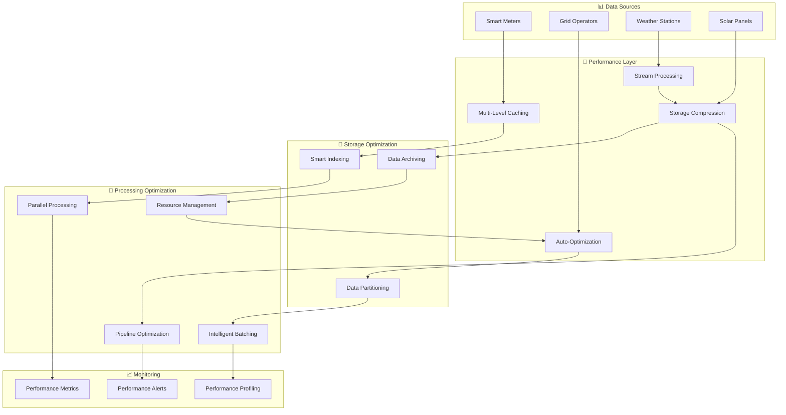

# Performance Optimization - Overview

The Metrify Smart Metering Platform implements comprehensive performance optimization strategies to ensure high throughput, low latency, and efficient resource utilization across all system components.

## ⚡ Performance Architecture



## 🎯 Performance Capabilities

### 1. Multi-Level Caching
- **In-Memory Cache**: Redis for fast data access
- **Application Cache**: Local application caching
- **Database Cache**: Query result caching
- **CDN Cache**: Content delivery optimization

### 2. Query Optimization
- **Query Analysis**: Automatic query analysis
- **Index Optimization**: Smart index management
- **Query Rewriting**: Automatic query optimization
- **Execution Planning**: Optimal execution plans

### 3. Stream Processing
- **Real-time Processing**: Low-latency stream processing
- **Window Operations**: Efficient window management
- **Backpressure Handling**: Flow control mechanisms
- **Fault Tolerance**: Stream processing reliability

### 4. Resource Management
- **Auto-scaling**: Automatic resource scaling
- **Load Balancing**: Intelligent load distribution
- **Resource Monitoring**: Real-time resource tracking
- **Cost Optimization**: Resource cost minimization

## 🛠️ Technology Stack

### Caching
- **Redis**: In-memory data store
- **Memcached**: Distributed memory caching
- **Hazelcast**: In-memory data grid
- **Custom Cache**: Application-specific caching

### Query Optimization
- **PostgreSQL**: Advanced query optimization
- **Snowflake**: Cloud data warehouse optimization
- **Apache Spark**: Big data processing optimization
- **Custom Optimizer**: Domain-specific optimization

### Stream Processing
- **Apache Kafka**: High-throughput messaging
- **Apache Flink**: Stream processing engine
- **Apache Storm**: Real-time processing
- **Custom Streams**: Specialized stream processing

### Performance Monitoring
- **Prometheus**: Metrics collection
- **Grafana**: Performance dashboards
- **Jaeger**: Distributed tracing
- **Custom Metrics**: Business-specific metrics

## 📊 Performance Components

### 1. Multi-Level Cache
```python
from src.performance.caching.multi_level_cache import MultiLevelCache

# Initialize multi-level cache
cache = MultiLevelCache()

# Configure cache levels
cache.configure_levels([
    {'type': 'memory', 'size': '1GB', 'ttl': 300},
    {'type': 'redis', 'host': 'localhost', 'port': 6379, 'ttl': 3600},
    {'type': 'database', 'connection': 'postgresql://...', 'ttl': 86400}
])

# Cache data
cache.set('smart_meter_data', data, ttl=3600)

# Retrieve data
cached_data = cache.get('smart_meter_data')
```

### 2. Query Optimizer
```python
from src.performance.optimization.query_optimizer import QueryOptimizer

# Initialize query optimizer
optimizer = QueryOptimizer()

# Optimize query
optimized_query = optimizer.optimize(
    query="SELECT * FROM meter_readings WHERE meter_id = ? AND timestamp > ?",
    parameters=['SM001', '2024-01-01'],
    context={'indexes': ['meter_id_idx', 'timestamp_idx']}
)

# Execute optimized query
results = optimizer.execute(optimized_query)
```

### 3. Stream Processor
```python
from src.performance.streaming.flink_integration import FlinkIntegration

# Initialize Flink integration
flink = FlinkIntegration()

# Create stream processing job
job = flink.create_job(
    name="smart_meter_processing",
    parallelism=4
)

# Add processing logic
job.add_source("smart_meter_topic")
job.add_processor("anomaly_detection")
job.add_sink("anomaly_alerts")

# Deploy job
flink.deploy_job(job)
```

### 4. Performance Monitor
```python
from src.performance.monitoring.performance_monitor import PerformanceMonitor

# Initialize performance monitor
monitor = PerformanceMonitor()

# Setup monitoring
monitor.setup_metrics([
    'response_time',
    'throughput',
    'error_rate',
    'resource_usage'
])

# Start monitoring
monitor.start_monitoring()
```

## ⚡ Performance Optimization Strategies

### 1. Database Optimization
```python
# Index optimization
def optimize_indexes(table_name, query_patterns):
    optimizer = IndexOptimizer()
    
    # Analyze query patterns
    patterns = optimizer.analyze_patterns(query_patterns)
    
    # Generate index recommendations
    recommendations = optimizer.recommend_indexes(patterns)
    
    # Apply recommendations
    for recommendation in recommendations:
        optimizer.create_index(table_name, recommendation)
```

### 2. Caching Strategy
```python
# Intelligent caching
def implement_caching_strategy():
    cache_strategy = {
        'hot_data': {
            'level': 'memory',
            'ttl': 300,  # 5 minutes
            'size': '100MB'
        },
        'warm_data': {
            'level': 'redis',
            'ttl': 3600,  # 1 hour
            'size': '1GB'
        },
        'cold_data': {
            'level': 'database',
            'ttl': 86400,  # 1 day
            'size': '10GB'
        }
    }
    
    return cache_strategy
```

### 3. Stream Processing Optimization
```python
# Stream processing optimization
def optimize_stream_processing():
    config = {
        'parallelism': 4,
        'checkpoint_interval': 1000,
        'buffer_timeout': 100,
        'max_parallelism': 8
    }
    
    # Configure Flink job
    flink_job = FlinkJob(config)
    
    # Add optimization rules
    flink_job.add_optimization_rule('operator_chaining')
    flink_job.add_optimization_rule('local_aggregation')
    flink_job.add_optimization_rule('late_data_handling')
    
    return flink_job
```

### 4. Resource Management
```python
# Auto-scaling configuration
def configure_auto_scaling():
    scaling_config = {
        'min_instances': 2,
        'max_instances': 10,
        'target_cpu_utilization': 70,
        'target_memory_utilization': 80,
        'scale_up_cooldown': 300,
        'scale_down_cooldown': 600
    }
    
    return scaling_config
```

## 📈 Performance Metrics

### 1. Response Time Metrics
- **Average Response Time**: Mean response time
- **P95 Response Time**: 95th percentile response time
- **P99 Response Time**: 99th percentile response time
- **Max Response Time**: Maximum response time

### 2. Throughput Metrics
- **Requests per Second**: RPS measurement
- **Data Processing Rate**: Data volume per second
- **Message Throughput**: Kafka message throughput
- **Database Throughput**: Database operations per second

### 3. Resource Utilization
- **CPU Utilization**: CPU usage percentage
- **Memory Utilization**: Memory usage percentage
- **Disk I/O**: Disk input/output operations
- **Network I/O**: Network input/output operations

### 4. Error Metrics
- **Error Rate**: Percentage of failed requests
- **Timeout Rate**: Percentage of timed-out requests
- **Retry Rate**: Percentage of retried requests
- **Circuit Breaker Trips**: Circuit breaker activation rate

## 🔄 Performance Pipeline

### 1. Performance Testing
```python
# Load testing
def run_load_test():
    from locust import HttpUser, task, between
    
    class SmartMeterUser(HttpUser):
        wait_time = between(1, 3)
        
        @task
        def get_meter_readings(self):
            self.client.get("/api/v1/meter-readings")
        
        @task
        def get_analytics(self):
            self.client.get("/api/v1/analytics/forecast")
    
    # Run load test
    run_locust_test()
```

### 2. Performance Profiling
```python
# Performance profiling
def profile_application():
    import cProfile
    import pstats
    
    # Profile application
    profiler = cProfile.Profile()
    profiler.enable()
    
    # Run application code
    run_application()
    
    profiler.disable()
    
    # Analyze results
    stats = pstats.Stats(profiler)
    stats.sort_stats('cumulative')
    stats.print_stats(10)
```

### 3. Performance Monitoring
```python
# Real-time performance monitoring
def monitor_performance():
    monitor = PerformanceMonitor()
    
    while True:
        # Collect metrics
        metrics = monitor.collect_metrics()
        
        # Check thresholds
        if metrics['response_time'] > 2.0:
            monitor.alert('High response time detected')
        
        if metrics['error_rate'] > 0.05:
            monitor.alert('High error rate detected')
        
        # Update dashboards
        monitor.update_dashboards(metrics)
        
        time.sleep(60)
```

## 📊 Performance Dashboards

### 1. Real-time Performance Dashboard
- **Live Metrics**: Real-time performance metrics
- **Response Time Charts**: Response time trends
- **Throughput Charts**: Throughput trends
- **Error Rate Charts**: Error rate trends

### 2. Resource Utilization Dashboard
- **CPU Usage**: CPU utilization over time
- **Memory Usage**: Memory utilization over time
- **Disk I/O**: Disk input/output operations
- **Network I/O**: Network input/output operations

### 3. Performance Analytics Dashboard
- **Performance Trends**: Historical performance trends
- **Bottleneck Analysis**: Performance bottleneck identification
- **Optimization Recommendations**: Performance improvement suggestions
- **Capacity Planning**: Resource capacity planning

## 🚀 Getting Started

### 1. Setup Performance Environment
```bash
# Install performance dependencies
pip install redis prometheus-client locust

# Start Redis
redis-server

# Start Prometheus
prometheus --config.file=prometheus.yml
```

### 2. Configure Performance Monitoring
```python
# Setup performance monitoring
from src.performance.monitoring.performance_monitor import PerformanceMonitor

monitor = PerformanceMonitor()
monitor.setup_metrics()
monitor.start_monitoring()
```

### 3. Run Performance Tests
```python
# Run performance tests
from src.performance.testing.performance_tester import PerformanceTester

tester = PerformanceTester()
tester.run_load_test()
tester.run_stress_test()
tester.run_endurance_test()
```

## 📚 Additional Resources

- [Caching Guide](caching-guide.md)
- [Query Optimization Guide](query-optimization-guide.md)
- [Stream Processing Guide](stream-processing-guide.md)
- [Performance Testing Guide](performance-testing-guide.md)
- [Monitoring Guide](monitoring-guide.md)
