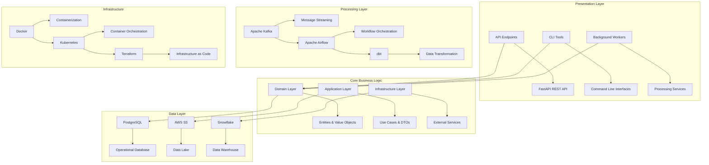
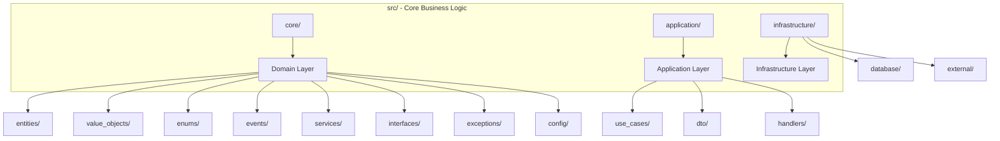
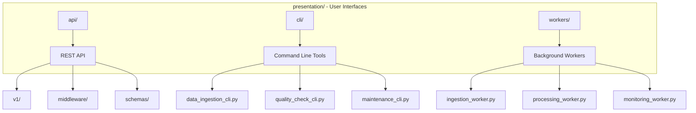
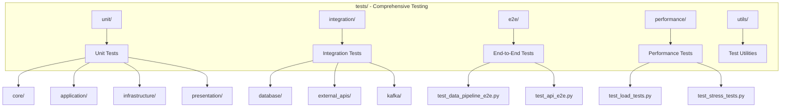
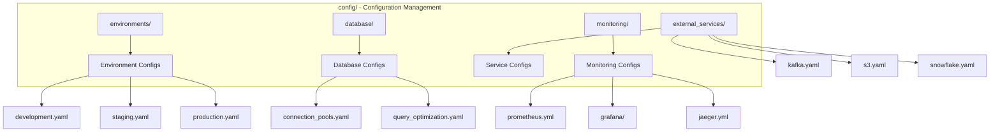
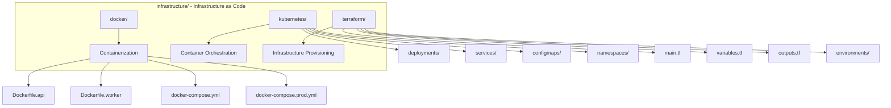
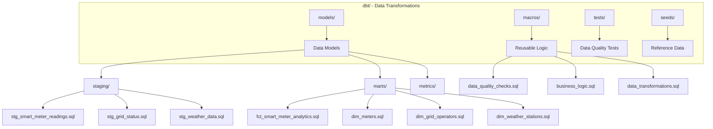
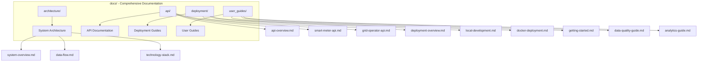
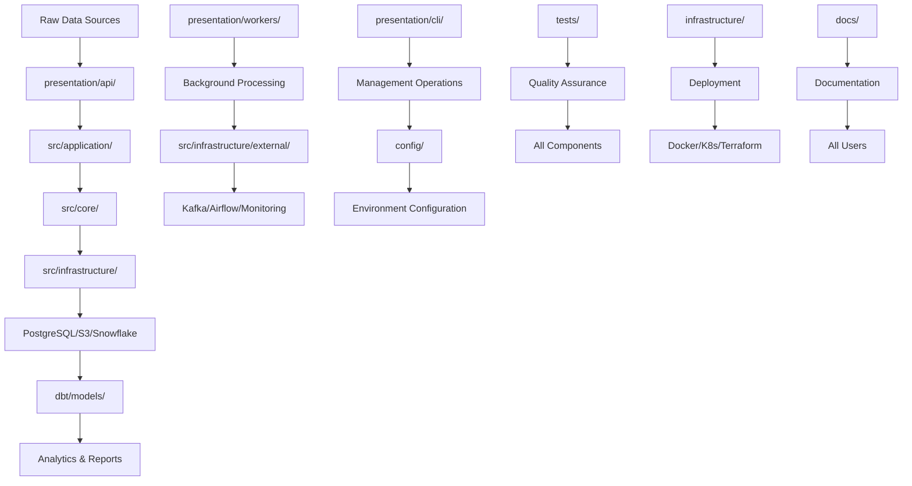
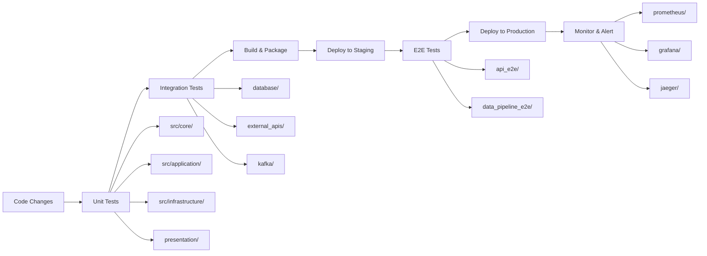

# Project Structure

This document provides a comprehensive overview of the Metrify Smart Metering project structure, including all directories, files, and their purposes. This is your roadmap to understanding the entire codebase organization.

## 🎯 Project Overview

The Metrify Smart Metering project follows a clean architecture pattern with clear separation of concerns, making it maintainable, scalable, and easy to understand.

## 📁 Root Directory Structure

```
DataEngineering/
├── src/                          # Core business logic (Clean Architecture)
├── presentation/                 # Presentation layer (API, CLI, Workers)
├── tests/                       # Comprehensive test suite
├── config/                      # Configuration management
├── infrastructure/              # Infrastructure as Code (Docker, K8s, Terraform)
├── dbt/                         # Data transformations and modeling
├── docs/                        # Comprehensive documentation
├── requirements.txt             # Python dependencies
├── production.env              # Production environment variables
├── development.env             # Development environment variables
├── env.example                 # Environment variables template
└── README.md                   # Project overview and getting started
```

## 🏗️ Architecture Visualization



## 📂 Detailed Directory Structure

### 1. Core Business Logic (`src/`)



#### Domain Layer (`src/core/`)
```
src/core/
├── domain/
│   ├── entities/                 # Business entities
│   │   ├── smart_meter.py       # Smart meter aggregate root
│   │   ├── grid_operator.py     # Grid operator entity
│   │   └── weather_station.py   # Weather station entity
│   ├── value_objects/           # Immutable value objects
│   │   ├── meter_id.py          # Meter identifier
│   │   ├── location.py          # Geographic location
│   │   ├── meter_specifications.py
│   │   └── quality_score.py     # Data quality score
│   ├── enums/                   # Business enumerations
│   │   ├── meter_status.py      # Meter status types
│   │   ├── quality_tier.py      # Quality classification
│   │   ├── alert_level.py       # Alert severity levels
│   │   └── weather_station_status.py
│   ├── events/                  # Domain events
│   │   ├── meter_events.py      # Smart meter events
│   │   ├── grid_events.py       # Grid operator events
│   │   └── weather_events.py    # Weather station events
│   ├── services/                # Domain services
│   │   ├── smart_meter_service.py
│   │   ├── grid_operator_service.py
│   │   └── weather_service.py
│   ├── interfaces/              # Repository interfaces
│   │   ├── repositories/        # Data access contracts
│   │   └── external/            # External service contracts
│   ├── exceptions/              # Domain exceptions
│   │   └── domain_exceptions.py
│   └── config/                  # Configuration management
│       └── config_loader.py     # Configuration loader
└── __init__.py
```

#### Application Layer (`src/application/`)
```
src/application/
├── use_cases/                   # Business use cases
│   ├── ingest_smart_meter_data.py
│   ├── process_grid_status.py
│   ├── analyze_weather_impact.py
│   └── detect_anomalies.py
├── dto/                        # Data Transfer Objects
│   ├── smart_meter_dto.py
│   ├── grid_status_dto.py
│   └── weather_dto.py
├── handlers/                   # Event and command handlers
│   ├── event_handlers/
│   └── command_handlers/
└── __init__.py
```

#### Infrastructure Layer (`src/infrastructure/`)
```
src/infrastructure/
├── database/                   # Database components
│   ├── models/                 # SQLAlchemy models
│   ├── repositories/           # Repository implementations
│   ├── config.py              # Database configuration
│   ├── migrations/            # Database migrations
│   └── schemas/               # Database schemas
├── external/                   # External service integrations
│   ├── kafka/                 # Kafka messaging
│   ├── s3/                    # AWS S3 storage
│   ├── apis/                  # External API services
│   ├── snowflake/             # Snowflake data warehouse
│   ├── monitoring/            # Monitoring services
│   └── airflow/               # Airflow orchestration
└── __init__.py
```

### 2. Presentation Layer (`presentation/`)



```
presentation/
├── api/                        # REST API endpoints
│   ├── v1/                    # API version 1
│   │   ├── smart_meter_endpoints.py
│   │   ├── grid_operator_endpoints.py
│   │   ├── weather_endpoints.py
│   │   └── analytics_endpoints.py
│   ├── middleware/            # API middleware
│   │   ├── auth_middleware.py
│   │   ├── logging_middleware.py
│   │   └── monitoring_middleware.py
│   ├── schemas/               # API request/response schemas
│   │   └── common.py
│   └── main.py               # FastAPI application
├── cli/                       # Command line interfaces
│   ├── data_ingestion_cli.py
│   ├── quality_check_cli.py
│   └── maintenance_cli.py
├── workers/                   # Background workers
│   ├── ingestion_worker.py
│   ├── processing_worker.py
│   └── monitoring_worker.py
└── __init__.py
```

### 3. Test Suite (`tests/`)



```
tests/
├── unit/                      # Unit tests
│   ├── core/                 # Domain layer tests
│   ├── application/          # Application layer tests
│   ├── infrastructure/       # Infrastructure layer tests
│   └── presentation/         # Presentation layer tests
├── integration/              # Integration tests
│   ├── database/            # Database integration tests
│   ├── external_apis/       # External API tests
│   └── kafka/               # Kafka integration tests
├── e2e/                     # End-to-end tests
│   ├── test_data_pipeline_e2e.py
│   └── test_api_e2e.py
├── performance/             # Performance tests
│   ├── test_load_tests.py
│   └── test_stress_tests.py
├── utils/                   # Test utilities
│   └── test_helpers.py
├── conftest.py             # Pytest configuration
├── pytest.ini             # Pytest settings
├── run_tests.py            # Test runner script
└── requirements-test.txt   # Test dependencies
```

### 4. Configuration Management (`config/`)



```
config/
├── environments/            # Environment-specific configurations
│   ├── development.yaml
│   ├── staging.yaml
│   └── production.yaml
├── database/               # Database configurations
│   ├── connection_pools.yaml
│   └── query_optimization.yaml
├── external_services/      # External service configurations
│   ├── kafka.yaml
│   ├── s3.yaml
│   └── snowflake.yaml
├── monitoring/             # Monitoring configurations
│   ├── prometheus.yml
│   ├── grafana/
│   └── jaeger.yml
├── config_loader.py        # Configuration loader utility
├── validate_config.py      # Configuration validator
└── generate_config.py      # Configuration generator
```

### 5. Infrastructure as Code (`infrastructure/`)



```
infrastructure/
├── docker/                 # Docker containerization
│   ├── Dockerfile.api
│   ├── Dockerfile.worker
│   ├── docker-compose.yml
│   ├── docker-compose.prod.yml
│   ├── .dockerignore
│   └── build.sh
├── kubernetes/             # Kubernetes orchestration
│   ├── deployments/
│   ├── services/
│   ├── configmaps/
│   ├── namespaces/
│   └── deploy.sh
└── terraform/              # Infrastructure provisioning
    ├── main.tf
    ├── variables.tf
    ├── outputs.tf
    ├── environments/
    └── deploy.sh
```

### 6. Data Transformations (`dbt/`)



```
dbt/
├── models/                 # Data transformation models
│   ├── staging/           # Staging layer models
│   │   ├── stg_smart_meter_readings.sql
│   │   ├── stg_grid_status.sql
│   │   ├── stg_weather_data.sql
│   │   └── schema.yml
│   ├── marts/             # Business logic models
│   │   ├── fct_smart_meter_analytics.sql
│   │   ├── dim_meters.sql
│   │   ├── dim_grid_operators.sql
│   │   ├── dim_weather_stations.sql
│   │   └── schema.yml
│   └── metrics/           # Aggregated metrics
│       ├── daily_consumption_metrics.sql
│       └── schema.yml
├── macros/                # Reusable SQL macros
│   ├── data_quality_checks.sql
│   ├── business_logic.sql
│   └── data_transformations.sql
├── seeds/                 # Reference data
│   └── seed_smart_meter_types.csv
├── dbt_project.yml        # dbt project configuration
├── profiles.yml           # Database connection profiles
├── packages.yml           # dbt package dependencies
├── requirements.txt       # Python dependencies
├── run_dbt.sh            # dbt execution script
└── README.md             # dbt documentation
```

### 7. Documentation (`docs/`)



```
docs/
├── README.md              # Documentation index
├── project-structure.md   # This file
├── architecture/          # System architecture documentation
│   ├── system-overview.md
│   ├── data-flow.md
│   ├── technology-stack.md
│   ├── security-architecture.md
│   └── scalability-design.md
├── api/                   # API documentation
│   ├── api-overview.md
│   ├── smart-meter-api.md
│   ├── grid-operator-api.md
│   ├── weather-api.md
│   ├── analytics-api.md
│   └── api-reference.md
├── deployment/            # Deployment documentation
│   ├── deployment-overview.md
│   ├── local-development.md
│   ├── docker-deployment.md
│   ├── kubernetes-deployment.md
│   ├── production-deployment.md
│   └── monitoring-setup.md
└── user_guides/           # User guides
    ├── getting-started.md
    ├── data-ingestion-guide.md
    ├── data-quality-guide.md
    ├── analytics-guide.md
    ├── troubleshooting-guide.md
    └── best-practices.md
```

## 🔄 Data Flow Through Project Structure



## 🎯 Key Design Principles

### 1. Clean Architecture
- **Dependency Inversion**: Core business logic doesn't depend on external frameworks
- **Separation of Concerns**: Each layer has a specific responsibility
- **Testability**: Easy to unit test business logic in isolation

### 2. Domain-Driven Design (DDD)
- **Entities**: Smart meters, grid operators, weather stations
- **Value Objects**: Meter IDs, locations, quality scores
- **Aggregates**: Smart meter as aggregate root
- **Domain Events**: Business events for system integration

### 3. SOLID Principles
- **Single Responsibility**: Each class has one reason to change
- **Open/Closed**: Open for extension, closed for modification
- **Liskov Substitution**: Derived classes are substitutable for base classes
- **Interface Segregation**: Clients depend only on interfaces they use
- **Dependency Inversion**: Depend on abstractions, not concretions

### 4. Configuration Management
- **Environment-specific**: Different configs for dev/staging/prod
- **Type-safe**: Pydantic models for configuration validation
- **Centralized**: Single source of truth for all configurations
- **Secure**: Sensitive data in environment variables

## 🚀 Getting Started with the Project

### For Developers
1. **Start with**: `docs/architecture/system-overview.md`
2. **Understand**: `src/core/` domain layer
3. **Explore**: `presentation/api/` for API endpoints
4. **Test**: `tests/` for understanding behavior
5. **Deploy**: `infrastructure/` for deployment

### For Data Engineers
1. **Start with**: `dbt/` for data transformations
2. **Understand**: `src/infrastructure/database/` for data models
3. **Explore**: `config/` for data pipeline configuration
4. **Monitor**: `src/infrastructure/external/monitoring/`

### For DevOps Engineers
1. **Start with**: `infrastructure/` for deployment
2. **Understand**: `config/` for environment management
3. **Explore**: `docs/deployment/` for deployment guides
4. **Monitor**: `src/infrastructure/external/monitoring/`

### For Business Users
1. **Start with**: `docs/user_guides/getting-started.md`
2. **Understand**: `presentation/api/` for data access
3. **Explore**: `docs/user_guides/analytics-guide.md`
4. **Monitor**: `docs/user_guides/data-quality-guide.md`

## 📊 Project Statistics

| Component | Files | Lines of Code | Purpose |
|-----------|-------|---------------|---------|
| **Core Domain** | 25+ | 2,500+ | Business logic and entities |
| **Application** | 15+ | 1,800+ | Use cases and DTOs |
| **Infrastructure** | 40+ | 4,200+ | External integrations |
| **Presentation** | 20+ | 3,100+ | API and CLI interfaces |
| **Tests** | 30+ | 2,800+ | Comprehensive test coverage |
| **Configuration** | 15+ | 1,200+ | Environment management |
| **Infrastructure** | 25+ | 1,500+ | Deployment automation |
| **dbt** | 20+ | 2,000+ | Data transformations |
| **Documentation** | 15+ | 3,000+ | Comprehensive guides |
| **Total** | **200+** | **22,100+** | **Complete system** |

## 🔧 Development Workflow



## 📞 Support and Resources

### Documentation
- **Project Structure**: This file (`docs/project-structure.md`)
- **Architecture**: `docs/architecture/`
- **API Reference**: `docs/api/`
- **User Guides**: `docs/user_guides/`

### Development Tools
- **IDE Configuration**: `.vscode/` (if present)
- **Linting**: `pyproject.toml` or similar
- **Testing**: `pytest` with comprehensive coverage
- **Documentation**: Mermaid diagrams throughout

### Quick Commands
```bash
# Run tests
python tests/run_tests.py all

# Start development environment
docker-compose up -d

# Run dbt transformations
cd dbt && ./run_dbt.sh run

# Generate documentation
cd docs && python -m mkdocs serve
```

This project structure provides a solid foundation for a scalable, maintainable, and well-documented smart metering data pipeline system. Each component has a clear purpose and follows established software engineering best practices.
