# Data Quality - Overview

The Metrify Smart Metering Platform implements comprehensive data quality management to ensure reliable, accurate, and trustworthy data throughout the entire data pipeline.

## 🔍 Quality Architecture

```mermaid
graph TB
    subgraph "📊 Data Sources"
        SM[Smart Meters]
        GRID[Grid Operators]
        WEATHER[Weather Stations]
        SOLAR[Solar Panels]
    end
    
    subgraph "🔍 Quality Detection"
        VALIDATION[Data Validation]
        PROFILING[Data Profiling]
        MONITORING[Quality Monitoring]
        DETECTION[Anomaly Detection]
    end
    
    subgraph "📊 Quality Metrics"
        COMPLETENESS[Completeness]
        ACCURACY[Accuracy]
        CONSISTENCY[Consistency]
        TIMELINESS[Timeliness]
        VALIDITY[Validity]
    end
    
    subgraph "🛠️ Quality Tools"
        GREAT_EXPECTATIONS[Great Expectations]
        CUSTOM_RULES[Custom Rules]
        ML_QUALITY[ML Quality Models]
        AUTOMATION[Quality Automation]
    end
    
    subgraph "📈 Quality Reporting"
        DASHBOARDS[Quality Dashboards]
        ALERTS[Quality Alerts]
        REPORTS[Quality Reports]
        METRICS[Quality Metrics]
    end
    
    SM --> VALIDATION
    GRID --> VALIDATION
    WEATHER --> PROFILING
    SOLAR --> PROFILING
    
    VALIDATION --> COMPLETENESS
    PROFILING --> ACCURACY
    MONITORING --> CONSISTENCY
    DETECTION --> TIMELINESS
    
    COMPLETENESS --> GREAT_EXPECTATIONS
    ACCURACY --> CUSTOM_RULES
    CONSISTENCY --> ML_QUALITY
    TIMELINESS --> AUTOMATION
    
    GREAT_EXPECTATIONS --> DASHBOARDS
    CUSTOM_RULES --> ALERTS
    ML_QUALITY --> REPORTS
    AUTOMATION --> METRICS
```



## 🎯 Quality Capabilities

### 1. Data Validation
- **Schema Validation**: Data structure validation
- **Type Validation**: Data type checking
- **Range Validation**: Value range validation
- **Format Validation**: Data format validation

### 2. Data Profiling
- **Statistical Profiling**: Statistical data analysis
- **Pattern Detection**: Data pattern identification
- **Distribution Analysis**: Data distribution analysis
- **Correlation Analysis**: Data relationship analysis

### 3. Quality Monitoring
- **Real-time Monitoring**: Continuous quality monitoring
- **Batch Monitoring**: Scheduled quality checks
- **Trend Analysis**: Quality trend identification
- **Alert Management**: Quality issue alerting

### 4. Quality Automation
- **Automated Validation**: Automatic quality checks
- **Auto-remediation**: Automatic quality fixes
- **Quality Gates**: Pipeline quality gates
- **Continuous Improvement**: Quality process optimization

## 🛠️ Technology Stack

### Core Quality Framework
- **Great Expectations**: Data validation framework
- **Apache Griffin**: Data quality service
- **Deequ**: Data quality library
- **Custom Quality Engine**: Business-specific validations

### Data Profiling
- **Pandas Profiling**: Automated data profiling
- **Sweetviz**: Automated EDA
- **DataPrep**: Data preparation and profiling
- **Custom Profilers**: Domain-specific profiling

### Quality Monitoring
- **Prometheus**: Quality metrics collection
- **Grafana**: Quality dashboards
- **DataDog**: Quality monitoring
- **Custom Monitors**: Business-specific monitoring

### Quality Automation
- **Apache Airflow**: Quality workflow orchestration
- **Custom Automation**: Quality process automation
- **ML Models**: Quality prediction and detection
- **Rule Engine**: Quality rule management

## 📊 Quality Dimensions

### 1. Completeness
- **Missing Values**: Percentage of missing data
- **Data Gaps**: Temporal data gaps
- **Coverage**: Data coverage analysis
- **Completeness Score**: Overall completeness metric

### 2. Accuracy
- **Data Correctness**: Data accuracy validation
- **Outlier Detection**: Statistical outlier identification
- **Business Rules**: Business logic validation
- **Accuracy Score**: Overall accuracy metric

### 3. Consistency
- **Cross-dataset Consistency**: Multi-dataset validation
- **Temporal Consistency**: Time-based consistency
- **Referential Integrity**: Data relationship validation
- **Consistency Score**: Overall consistency metric

### 4. Timeliness
- **Data Freshness**: Data recency analysis
- **Processing Latency**: Data processing delays
- **Delivery Time**: Data delivery timing
- **Timeliness Score**: Overall timeliness metric

### 5. Validity
- **Format Validity**: Data format validation
- **Range Validity**: Value range validation
- **Constraint Validity**: Business constraint validation
- **Validity Score**: Overall validity metric

## 🔧 Quality Implementation

### 1. Great Expectations Integration
```python
import great_expectations as ge
from great_expectations.core import ExpectationSuite

# Create expectation suite
suite = ExpectationSuite(expectation_suite_name="smart_meter_quality")

# Add expectations
suite.add_expectation(
    ge.expectations.ExpectColumnValuesToNotBeNull(
        column="meter_id"
    )
)

suite.add_expectation(
    ge.expectations.ExpectColumnValuesToBeBetween(
        column="energy_consumed_kwh",
        min_value=0,
        max_value=1000
    )
)

# Validate data
results = ge.validate(
    df=smart_meter_data,
    expectation_suite=suite
)
```

### 2. Custom Quality Rules
```python
from src.quality.rules.custom_validators import CustomValidator

# Create custom validator
validator = CustomValidator()

# Add business rules
validator.add_rule(
    name="energy_consumption_reasonable",
    rule=lambda row: 0 <= row['energy_consumed_kwh'] <= 1000,
    description="Energy consumption must be between 0 and 1000 kWh"
)

validator.add_rule(
    name="timestamp_recent",
    rule=lambda row: (datetime.now() - row['timestamp']).days <= 7,
    description="Data must be within last 7 days"
)

# Validate data
results = validator.validate(smart_meter_data)
```

### 3. ML-Based Quality Detection
```python
from src.quality.ml.quality_predictor import QualityPredictor

# Initialize quality predictor
predictor = QualityPredictor()

# Train quality model
predictor.train(
    data=historical_data,
    quality_labels=quality_labels
)

# Predict data quality
quality_scores = predictor.predict(data=new_data)

# Identify low-quality data
low_quality_data = data[quality_scores < 0.8]
```

### 4. Quality Monitoring
```python
from src.quality.monitoring.quality_monitor import QualityMonitor

# Initialize quality monitor
monitor = QualityMonitor()

# Setup quality checks
monitor.add_check(
    name="completeness_check",
    check_type="completeness",
    threshold=0.95
)

monitor.add_check(
    name="accuracy_check",
    check_type="accuracy",
    threshold=0.90
)

# Start monitoring
monitor.start_monitoring()
```

## 📈 Quality Metrics

### 1. Overall Quality Score
```python
# Calculate overall quality score
def calculate_quality_score(data):
    completeness = calculate_completeness(data)
    accuracy = calculate_accuracy(data)
    consistency = calculate_consistency(data)
    timeliness = calculate_timeliness(data)
    validity = calculate_validity(data)
    
    # Weighted average
    weights = {
        'completeness': 0.25,
        'accuracy': 0.25,
        'consistency': 0.20,
        'timeliness': 0.15,
        'validity': 0.15
    }
    
    overall_score = (
        completeness * weights['completeness'] +
        accuracy * weights['accuracy'] +
        consistency * weights['consistency'] +
        timeliness * weights['timeliness'] +
        validity * weights['validity']
    )
    
    return overall_score
```

### 2. Quality Trends
```python
# Track quality trends over time
def track_quality_trends(data, time_window=30):
    trends = {}
    
    for day in range(time_window):
        day_data = data[data['date'] == day]
        quality_score = calculate_quality_score(day_data)
        trends[day] = quality_score
    
    return trends
```

### 3. Quality Alerts
```python
# Quality alert system
class QualityAlertSystem:
    def __init__(self):
        self.thresholds = {
            'critical': 0.7,
            'warning': 0.8,
            'good': 0.9
        }
    
    def check_quality(self, data):
        quality_score = calculate_quality_score(data)
        
        if quality_score < self.thresholds['critical']:
            self.send_alert('CRITICAL', quality_score)
        elif quality_score < self.thresholds['warning']:
            self.send_alert('WARNING', quality_score)
        elif quality_score < self.thresholds['good']:
            self.send_alert('INFO', quality_score)
```

## 🔄 Quality Pipeline

### 1. Data Ingestion Quality
```python
# Quality checks during data ingestion
def ingest_with_quality(data):
    # Pre-ingestion validation
    validation_results = validate_data(data)
    
    if validation_results.passed:
        # Ingest data
        ingest_data(data)
        
        # Post-ingestion quality check
        quality_score = calculate_quality_score(data)
        
        if quality_score < 0.8:
            trigger_quality_alert(quality_score)
    else:
        reject_data(data, validation_results.errors)
```

### 2. Real-time Quality Monitoring
```python
# Real-time quality monitoring
def monitor_quality_realtime():
    while True:
        # Get latest data
        latest_data = get_latest_data()
        
        # Check quality
        quality_score = calculate_quality_score(latest_data)
        
        # Update quality metrics
        update_quality_metrics(quality_score)
        
        # Check for alerts
        check_quality_alerts(quality_score)
        
        time.sleep(60)  # Check every minute
```

### 3. Quality Reporting
```python
# Generate quality reports
def generate_quality_report(data, time_period):
    report = {
        'period': time_period,
        'overall_score': calculate_quality_score(data),
        'dimensions': {
            'completeness': calculate_completeness(data),
            'accuracy': calculate_accuracy(data),
            'consistency': calculate_consistency(data),
            'timeliness': calculate_timeliness(data),
            'validity': calculate_validity(data)
        },
        'issues': identify_quality_issues(data),
        'recommendations': generate_quality_recommendations(data)
    }
    
    return report
```

## 📊 Quality Dashboards

### 1. Real-time Quality Dashboard
- **Live Quality Metrics**: Real-time quality scores
- **Quality Trends**: Historical quality trends
- **Issue Alerts**: Current quality issues
- **Quality Distribution**: Quality score distribution

### 2. Quality Analytics Dashboard
- **Quality Breakdown**: Dimension-wise quality analysis
- **Root Cause Analysis**: Quality issue root causes
- **Improvement Tracking**: Quality improvement progress
- **Benchmarking**: Quality benchmarking

### 3. Quality Management Dashboard
- **Quality Rules**: Active quality rules
- **Quality Gates**: Pipeline quality gates
- **Quality Automation**: Automated quality processes
- **Quality Metrics**: Comprehensive quality metrics

## 🚀 Getting Started

### 1. Setup Quality Environment
```bash
# Install quality dependencies
pip install great-expectations pandas-profiling

# Initialize Great Expectations
great_expectations init

# Create data source
great_expectations datasource new
```

### 2. Create Quality Rules
```python
# Create quality rules
from src.quality.rules.rule_creator import RuleCreator

rule_creator = RuleCreator()
rule_creator.create_smart_meter_rules()
rule_creator.create_weather_rules()
rule_creator.create_grid_rules()
```

### 3. Setup Quality Monitoring
```python
# Setup quality monitoring
from src.quality.monitoring.quality_monitor import QualityMonitor

monitor = QualityMonitor()
monitor.setup_monitoring()
monitor.start_monitoring()
```

## 📚 Additional Resources

- [Quality Rules Guide](quality-rules.md)
- [Quality Monitoring Guide](quality-monitoring.md)
- [Quality Automation Guide](quality-automation.md)
- [Quality Reporting Guide](quality-reporting.md)
- [Quality Troubleshooting Guide](quality-troubleshooting.md)
