# Analytics Guide

This guide will help you understand and use the analytics capabilities of the Metrify Smart Metering system. Learn how to create insights, generate reports, and make data-driven decisions.

## 🎯 What is Analytics?

Analytics in the Metrify system helps you:
- **Understand patterns** in energy consumption and grid behavior
- **Identify trends** and anomalies in your data
- **Make predictions** about future energy demand
- **Optimize operations** based on data insights
- **Generate reports** for stakeholders and decision-makers

## 📊 Analytics Overview


## 🔍 Types of Analytics Available

### 1. Descriptive Analytics
**What happened?** - Understanding past and current data


### 2. Diagnostic Analytics
**Why did it happen?** - Understanding causes and relationships


### 3. Predictive Analytics
**What will happen?** - Forecasting future trends and events


### 4. Prescriptive Analytics
**What should we do?** - Recommending actions and optimizations


## 📈 Analytics Dashboards

### Main Analytics Dashboard


### Key Metrics Dashboard

```mermaid
graph TB
    subgraph "Key Metrics"
        A[Energy Consumption] --> B[Total kWh: 1,234,567]
        A --> C[Daily Average: 45,678]
        A --> D[Peak Demand: 89,123]
        
        E[Grid Performance] --> F[Stability: 98.5%]
        E --> G[Efficiency: 94.2%]
        E --> H[Uptime: 99.9%]
        
        I[Data Quality] --> J[Overall Score: 95.2%]
        I --> K[Completeness: 98.1%]
        I --> L[Accuracy: 94.8%]
        
        M[Weather Impact] --> N[Temperature: 22°C]
        M --> O[Humidity: 65%]
        M --> P[Wind: 12 km/h]
    end
```



## 📊 Creating Analytics Reports

### Step-by-Step Report Creation


### Report Types Available

#### 1. Consumption Reports


#### 2. Quality Reports


#### 3. Performance Reports


## 🎨 Visualization Types

### Chart Types and Use Cases

#### 1. Line Charts
**Best for**: Trends over time


#### 2. Bar Charts
**Best for**: Comparing categories


#### 3. Pie Charts
**Best for**: Showing proportions


#### 4. Heat Maps
**Best for**: Patterns and correlations


#### 5. Scatter Plots
**Best for**: Relationships between variables


## 🔍 Advanced Analytics Features

### 1. Time Series Analysis


### 2. Correlation Analysis


### 3. Predictive Modeling


## 📊 Custom Analytics

### Creating Custom Analytics

#### 1. Custom Metrics


#### 2. Custom Dashboards
```mermaid
flowchart TD
    A[Custom Dashboards] --> B[Choose Layout]
    B --> C[Add Widgets]
    C --> D[Configure Filters]
    D --> E[Set Refresh Rate]
    E --> F[Save Dashboard]
    
    B --> G[Grid Layout]
    B --> H[Freeform Layout]
    B --> I[Template Layout]
    
    C --> J[Charts]
    C --> K[Tables]
    C --> L[Metrics]
    C --> M[Text Widgets]
    
    D --> N[Date Range]
    D --> O[Data Source]
    D --> P[Location]
    D --> Q[Custom Filters]
```

## 📈 Analytics Best Practices

### 1. Data Preparation
```mermaid
flowchart TD
    A[Data Preparation] --> B[Data Cleaning]
    A --> C[Data Validation]
    A --> D[Data Transformation]
    A --> E[Data Aggregation]
    
    B --> F[Remove Duplicates]
    B --> G[Handle Missing Values]
    B --> H[Fix Data Errors]
    
    C --> I[Check Data Types]
    C --> J[Validate Ranges]
    C --> K[Verify Business Rules]
    
    D --> L[Normalize Data]
    D --> M[Create Derived Fields]
    D --> N[Apply Calculations]
    
    E --> O[Group by Time]
    E --> P[Group by Category]
    E --> Q[Calculate Summaries]
```

### 2. Visualization Best Practices
- **Choose the right chart type** for your data
- **Use consistent colors** and formatting
- **Include clear labels** and titles
- **Provide context** with annotations
- **Keep it simple** and focused

### 3. Report Design
- **Start with key insights** and summary
- **Use executive summary** for high-level reports
- **Include methodology** and data sources
- **Provide actionable recommendations**
- **Use consistent formatting** and branding

## 🔧 Analytics Tools and Features

### Available Tools

#### 1. Query Builder
- **Visual query interface** for non-technical users
- **Pre-built query templates** for common analyses
- **Custom query creation** for advanced users
- **Query optimization** and performance tuning

#### 2. Data Explorer
- **Interactive data exploration** tools
- **Data profiling** and statistics
- **Data quality assessment** tools
- **Data sampling** and preview

#### 3. Report Builder
- **Drag-and-drop report creation**
- **Template library** for common reports
- **Custom formatting** and styling
- **Automated report generation**

#### 4. Dashboard Designer
- **Interactive dashboard creation**
- **Widget library** with various chart types
- **Real-time data** integration
- **Responsive design** for mobile devices

## 📞 Getting Help with Analytics

### Support Resources
- **Analytics Team**: analytics@metrify.com
- **Technical Support**: support@metrify.com
- **Training Team**: training@metrify.com
- **Documentation**: Analytics guides and tutorials

### Self-Service Options
- **Analytics Dashboard**: Interactive analytics tools
- **Report Library**: Pre-built reports and templates
- **Knowledge Base**: Analytics troubleshooting guides
- **Community Forum**: User discussions and tips

### Training and Learning
- **Analytics Training**: Comprehensive analytics courses
- **Video Tutorials**: Step-by-step analytics guides
- **Best Practices**: Analytics best practices and tips
- **Case Studies**: Real-world analytics examples

Remember: Analytics is a powerful tool for understanding your data and making informed decisions. Start with simple analyses and gradually build up to more complex insights. If you need help or have questions, don't hesitate to contact our analytics team.
