# Data Quality Guide

This guide explains how to understand, monitor, and manage data quality in the Metrify Smart Metering system. Data quality is crucial for making accurate business decisions and ensuring reliable system operations.

## 🎯 What is Data Quality?

Data quality refers to the accuracy, completeness, consistency, and reliability of data in our system. High-quality data ensures that:
- **Business decisions** are based on accurate information
- **Analytics and reports** provide reliable insights
- **System operations** run smoothly and efficiently
- **Customer service** is based on trustworthy data

## 📊 Data Quality Dimensions

## 🔍 Understanding Quality Scores

### Quality Score Scale

```mermaid
graph LR
    A[0-20%] --> B[Poor Quality]
    C[21-40%] --> D[Fair Quality]
    E[41-60%] --> F[Good Quality]
    G[61-80%] --> H[Very Good Quality]
    I[81-100%] --> J[Excellent Quality]
    
    B --> K[🔴 Critical Issues]
    D --> L[🟡 Needs Attention]
    F --> M[🟢 Acceptable]
    H --> N[🟢 Good Performance]
    J --> O[🟢 Excellent Performance]
```

### Quality Tier Classifications

| Tier | Score Range | Description | Action Required |
|------|-------------|-------------|-----------------|
| **EXCELLENT** | 81-100% | High-quality data with minimal issues | None - optimal performance |
| **GOOD** | 61-80% | Good quality data with minor issues | Monitor and maintain |
| **FAIR** | 41-60% | Acceptable quality with some concerns | Review and improve |
| **POOR** | 21-40% | Poor quality with significant issues | Immediate attention needed |
| **CRITICAL** | 0-20% | Critical quality issues | Urgent action required |

## 📈 Data Quality Monitoring Dashboard

### Main Quality Dashboard

### Quality Metrics Explained

#### Completeness
- **Definition**: Percentage of non-null values in required fields
- **Calculation**: (Non-null values / Total values) × 100
- **Target**: > 95%
- **Example**: If 1000 records have 950 complete values, completeness = 95%

#### Accuracy
- **Definition**: Percentage of values that are correct and valid
- **Calculation**: (Valid values / Total values) × 100
- **Target**: > 90%
- **Example**: If 1000 readings have 900 valid values, accuracy = 90%

#### Consistency
- **Definition**: Percentage of values that follow the same format and rules
- **Calculation**: (Consistent values / Total values) × 100
- **Target**: > 95%
- **Example**: If 1000 records follow the same format, consistency = 100%

#### Timeliness
- **Definition**: Percentage of data that arrives within expected timeframes
- **Calculation**: (On-time data / Total data) × 100
- **Target**: > 95%
- **Example**: If 1000 readings arrive on time, timeliness = 100%

## 🚨 Quality Alerts and Notifications

### Alert Types

### Alert Severity Levels

| Level | Icon | Description | Action Required |
|-------|------|-------------|-----------------|
| **Critical** | 🔴 | Data quality below 50% | Immediate investigation and fix |
| **High** | 🟠 | Data quality 50-70% | Address within 4 hours |
| **Medium** | 🟡 | Data quality 70-85% | Address within 24 hours |
| **Low** | 🔵 | Data quality 85-95% | Monitor and maintain |
| **Info** | ⚪ | Data quality > 95% | No action needed |

## 🔧 Managing Data Quality Issues

### Quality Issue Resolution Process

### Common Quality Issues and Solutions

#### 1. Missing Data
**Problem**: Required fields are empty or null
**Causes**: 
- Data source failures
- Network connectivity issues
- System configuration problems

**Solutions**:

#### 2. Invalid Data Format
**Problem**: Data doesn't match expected format
**Causes**:
- Incorrect data entry
- System integration issues
- Format changes

**Solutions**:

#### 3. Out-of-Range Values
**Problem**: Values exceed expected ranges
**Causes**:
- Sensor malfunctions
- Data entry errors
- System bugs

**Solutions**:

#### 4. Duplicate Data
**Problem**: Same data appears multiple times
**Causes**:
- System integration issues
- Data processing errors
- Configuration problems

**Solutions**:

## 📊 Quality Reporting and Analytics

### Quality Reports Available

#### 1. Daily Quality Summary

#### 2. Quality Trend Analysis
- **Weekly Trends**: Quality scores over time
- **Monthly Patterns**: Seasonal quality variations
- **Source Comparison**: Quality across different data sources
- **Predictive Analytics**: Quality forecasting

#### 3. Quality Issue Reports
- **Issue Summary**: Count and types of quality issues
- **Resolution Status**: Track issue resolution progress
- **Impact Analysis**: Business impact of quality issues
- **Root Cause Analysis**: Identify common causes

### Quality Dashboards

#### Executive Dashboard

#### Operational Dashboard

## 🎯 Best Practices for Data Quality

### 1. Proactive Quality Management

### 2. Continuous Improvement
- **Regular Reviews**: Weekly quality reviews
- **Trend Analysis**: Monthly quality trend analysis
- **Process Updates**: Quarterly process improvements
- **Technology Upgrades**: Annual technology assessments

### 3. Quality Governance
- **Quality Policies**: Clear quality standards and procedures
- **Roles and Responsibilities**: Defined quality roles
- **Quality Metrics**: Measurable quality indicators
- **Quality Audits**: Regular quality assessments

## 🔧 Quality Tools and Features

### Available Quality Tools

#### 1. Data Validation
- **Real-time Validation**: Immediate data quality checks
- **Batch Validation**: Comprehensive quality analysis
- **Custom Rules**: Business-specific validation rules
- **Format Validation**: Data format compliance

#### 2. Anomaly Detection
- **Statistical Analysis**: Identify unusual patterns
- **Machine Learning**: Advanced anomaly detection
- **Threshold Monitoring**: Alert on value thresholds
- **Pattern Recognition**: Detect data patterns

#### 3. Quality Monitoring
- **Real-time Dashboards**: Live quality monitoring
- **Quality Reports**: Comprehensive quality analysis
- **Alert System**: Proactive quality notifications
- **Trend Analysis**: Quality trend tracking

#### 4. Data Correction
- **Automatic Correction**: Fix common quality issues
- **Manual Correction**: Human intervention for complex issues
- **Data Enrichment**: Enhance incomplete data
- **Data Cleansing**: Remove or correct bad data

## 📞 Getting Help with Data Quality

### Support Resources
- **Quality Team**: data-quality@metrify.com
- **Technical Support**: support@metrify.com
- **Training Team**: training@metrify.com
- **Documentation**: Quality guides and best practices

### Self-Service Options
- **Quality Dashboard**: Real-time quality monitoring
- **Quality Reports**: Detailed quality analysis
- **Knowledge Base**: Quality troubleshooting guides
- **Community Forum**: Peer support and tips

### Emergency Support
- **Critical Issues**: 24/7 emergency support
- **Data Loss**: Immediate response team
- **System Failures**: Rapid resolution process
- **Quality Crises**: Escalation procedures

Remember: High data quality is essential for making accurate business decisions and ensuring reliable system operations. If you have any questions about data quality or need assistance with quality issues, don't hesitate to contact our support team.
