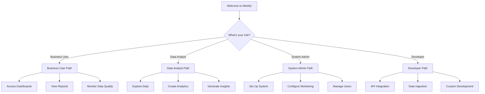
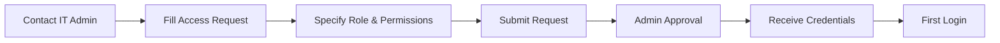
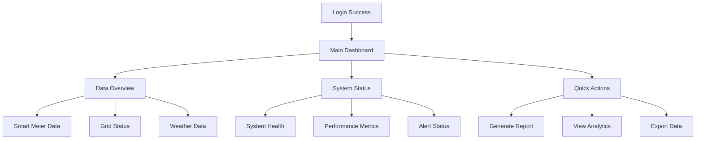
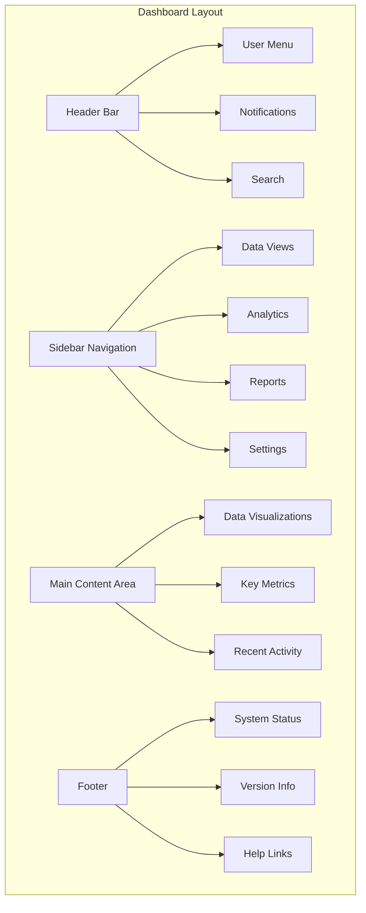
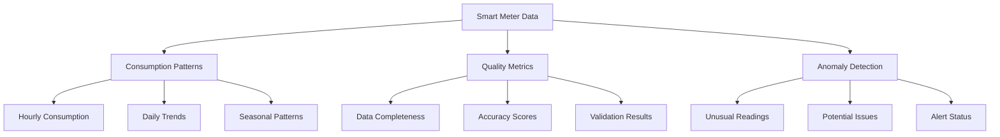
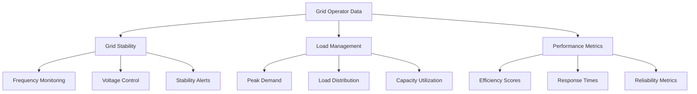
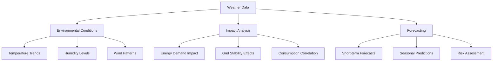
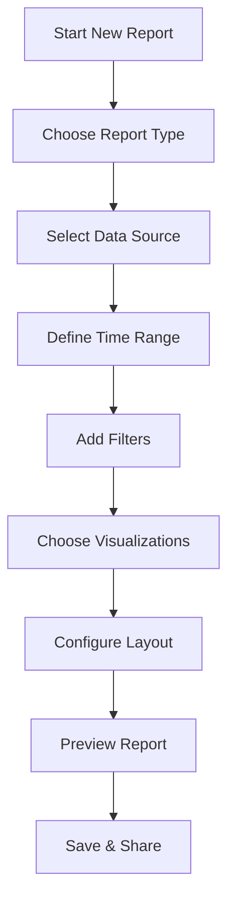
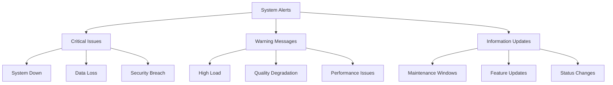
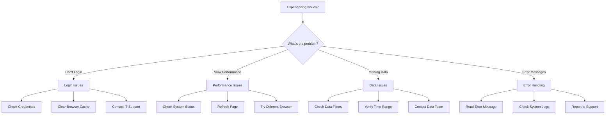

# Getting Started Guide

Welcome to the Metrify Smart Metering system! This guide will help you get up and running quickly, whether you're a business user, data analyst, or system administrator.

## 🎯 What is Metrify Smart Metering?

Metrify Smart Metering is a comprehensive data platform that collects, processes, and analyzes smart meter data to help energy companies optimize their operations and provide better services to customers.

## 🚀 Quick Start Overview

## 👥 User Roles and Access

### Business Users
- **Access**: Dashboards and reports
- **Purpose**: Monitor system health and business metrics
- **Tools**: Web interface, mobile app

### Data Analysts
- **Access**: Analytics tools and data exploration
- **Purpose**: Create insights and reports
- **Tools**: Grafana, SQL queries, API access

### System Administrators
- **Access**: Full system configuration
- **Purpose**: Manage infrastructure and users
- **Tools**: Admin console, monitoring tools

### Developers
- **Access**: API endpoints and development tools
- **Purpose**: Integrate with external systems
- **Tools**: REST API, CLI tools, SDKs

## 🔐 Getting Access

### Step 1: Request Access

### Step 2: Initial Login
1. **Navigate** to the Metrify portal
2. **Enter** your username and password
3. **Complete** two-factor authentication
4. **Accept** terms and conditions
5. **Set up** your profile

### Step 3: Explore the Interface

## 📊 Understanding the Dashboard

### Main Dashboard Components

### Key Metrics Explained

| Metric | Description | What It Means |
|--------|-------------|---------------|
| **Data Quality Score** | Overall data quality percentage | Higher = more reliable data |
| **System Uptime** | Percentage of time system is available | Higher = more reliable service |
| **Data Processing Rate** | Records processed per minute | Higher = better performance |
| **Anomaly Detection** | Number of unusual readings found | Lower = more stable data |

## 🔍 Exploring Data

### Smart Meter Data

### Grid Operator Data

### Weather Data

## 📈 Creating Your First Report

### Step-by-Step Report Creation

### Report Types Available

1. **Consumption Reports**
   - Daily, weekly, monthly consumption
   - Peak demand analysis
   - Seasonal trends

2. **Quality Reports**
   - Data quality metrics
   - Anomaly detection results
   - System performance

3. **Grid Reports**
   - Grid stability analysis
   - Load management insights
   - Operator performance

4. **Weather Reports**
   - Environmental impact
   - Correlation analysis
   - Forecasting accuracy

## 🚨 Understanding Alerts and Notifications

### Alert Types

### Alert Severity Levels

| Level | Color | Action Required | Description |
|-------|-------|-----------------|-------------|
| **Critical** | 🔴 Red | Immediate | System failure or data loss |
| **Warning** | 🟡 Yellow | Soon | Performance issues or quality concerns |
| **Info** | 🔵 Blue | None | General information or updates |

## 🔧 Basic Troubleshooting

### Common Issues and Solutions

### Quick Fixes

1. **Page Not Loading**
   - Refresh the browser
   - Clear browser cache
   - Check internet connection

2. **Slow Performance**
   - Close unnecessary tabs
   - Check system status
   - Try during off-peak hours

3. **Missing Data**
   - Verify date range
   - Check data filters
   - Contact data team

4. **Login Issues**
   - Verify username/password
   - Check if account is active
   - Contact IT support

## 📚 Learning Resources

### Documentation
- **User Manual**: Complete guide to all features
- **API Documentation**: For developers and integrators
- **Video Tutorials**: Step-by-step walkthroughs
- **FAQ**: Frequently asked questions

### Training Materials
- **Getting Started Course**: Basic system navigation
- **Advanced Analytics**: Creating complex reports
- **Data Quality**: Understanding and managing data quality
- **Best Practices**: Recommended workflows

### Support Channels
- **Help Desk**: Technical support and troubleshooting
- **User Community**: Peer-to-peer support and discussions
- **Knowledge Base**: Searchable articles and guides
- **Video Library**: Recorded training sessions

## 🎯 Next Steps

### For Business Users
1. **Explore Dashboards**: Familiarize yourself with the interface
2. **Create Reports**: Generate your first business report
3. **Set Up Alerts**: Configure notifications for important metrics
4. **Join Training**: Attend user training sessions

### For Data Analysts
1. **Access Analytics Tools**: Explore advanced data analysis features
2. **Learn SQL**: Understand data querying capabilities
3. **Create Dashboards**: Build custom visualizations
4. **API Integration**: Learn to use the REST API

### For System Administrators
1. **Configure System**: Set up monitoring and alerts
2. **Manage Users**: Create and manage user accounts
3. **System Monitoring**: Set up comprehensive monitoring
4. **Backup Strategy**: Implement data backup procedures

## 📞 Getting Help

### Support Contacts
- **Technical Support**: support@metrify.com
- **User Training**: training@metrify.com
- **System Administration**: admin@metrify.com
- **Emergency Support**: +1-800-METRIFY

### Support Hours
- **Business Hours**: Monday-Friday, 8 AM - 6 PM EST
- **Emergency Support**: 24/7 for critical issues
- **Training Sessions**: Scheduled weekly
- **Office Hours**: Drop-in support available

### Self-Service Options
- **Knowledge Base**: Searchable help articles
- **Video Tutorials**: Step-by-step guides
- **Community Forum**: User discussions and tips
- **Documentation**: Comprehensive user guides

Welcome to Metrify Smart Metering! We're here to help you succeed. If you have any questions or need assistance, don't hesitate to reach out to our support team.
